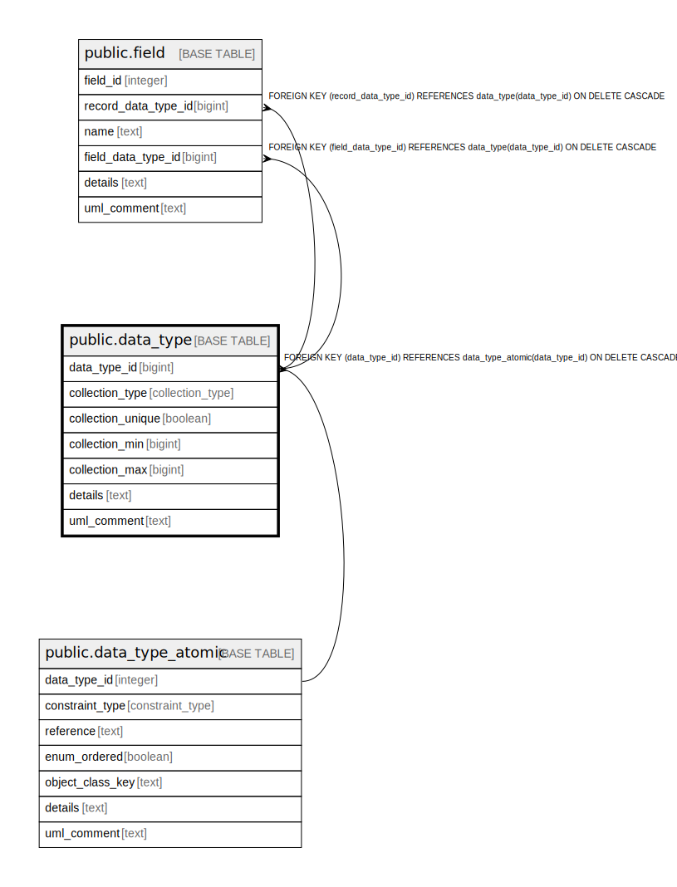

# public.data_type

## Description

An data type for use in a class attribute or action parameter.

## Columns

| Name | Type | Default | Nullable | Children | Parents | Comment |
| ---- | ---- | ------- | -------- | -------- | ------- | ------- |
| data_type_id | bigint |  | false | [public.field](public.field.md) | [public.data_type_atomic](public.data_type_atomic.md) | The internal ID, the atomic table is the source. |
| collection_type | collection_type | 'atomic'::collection_type | false |  |  | Whether a collection or atomic value, and if a collection what kind. |
| collection_unique | boolean |  | true |  |  | If a collection, is this collection unique. |
| collection_min | bigint |  | true |  |  | If a collection and there is a minimum number of items, the minimum. |
| collection_max | bigint |  | true |  |  | If a collection and there is a maximum number of items, the maximum. |
| details | text |  | true |  |  | A summary description. |
| uml_comment | text |  | true |  |  | A comment that appears in the diagrams. |

## Constraints

| Name | Type | Definition |
| ---- | ---- | ---------- |
| fk_data_type_atomic | FOREIGN KEY | FOREIGN KEY (data_type_id) REFERENCES data_type_atomic(data_type_id) ON DELETE CASCADE |
| data_type_pkey | PRIMARY KEY | PRIMARY KEY (data_type_id) |

## Indexes

| Name | Definition |
| ---- | ---------- |
| data_type_pkey | CREATE UNIQUE INDEX data_type_pkey ON public.data_type USING btree (data_type_id) |

## Relations

---

> Generated by [tbls](https://github.com/k1LoW/tbls)
