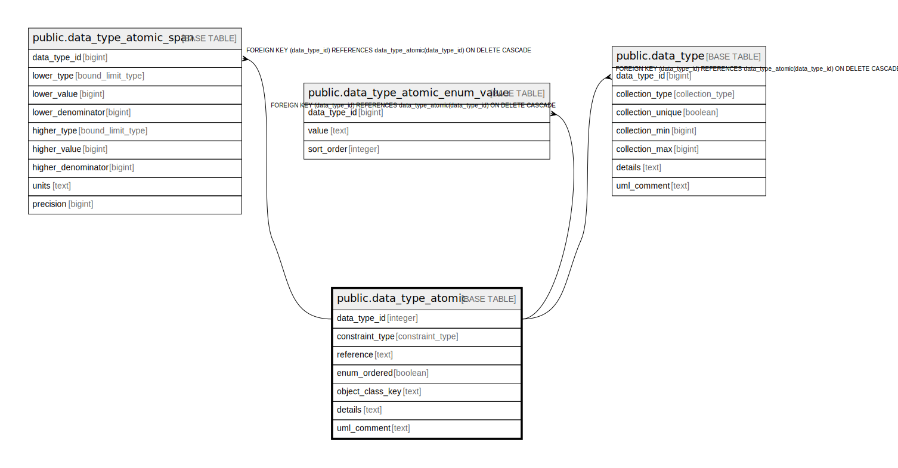

# public.data_type_atomic

## Description

An atomic type that backs a data type for eventually use in a class attribute or action parameter.

## Columns

| Name | Type | Default | Nullable | Children | Parents | Comment |
| ---- | ---- | ------- | -------- | -------- | ------- | ------- |
| data_type_id | integer | nextval('data_type_atomic_data_type_id_seq'::regclass) | false | [public.data_type_atomic_span](public.data_type_atomic_span.md) [public.data_type_atomic_enum_value](public.data_type_atomic_enum_value.md) [public.data_type](public.data_type.md) |  | The internal ID. |
| constraint_type | constraint_type | 'unconstrained'::constraint_type | false |  |  | The constraints on values for this attribute. |
| reference | text |  | true |  |  | If this is a reference, the details that define it. |
| enum_ordered | boolean |  | true |  |  | If this is an enumeration, enumerations could be ordered, so that should be clear. |
| object_class_key | text |  | true |  |  | If this is an object, which class it is. |
| details | text |  | true |  |  | A summary description. |
| uml_comment | text |  | true |  |  | A comment that appears in the diagrams. |

## Constraints

| Name | Type | Definition |
| ---- | ---- | ---------- |
| data_type_atomic_pkey | PRIMARY KEY | PRIMARY KEY (data_type_id) |

## Indexes

| Name | Definition |
| ---- | ---------- |
| data_type_atomic_pkey | CREATE UNIQUE INDEX data_type_atomic_pkey ON public.data_type_atomic USING btree (data_type_id) |

## Relations

---

> Generated by [tbls](https://github.com/k1LoW/tbls)
