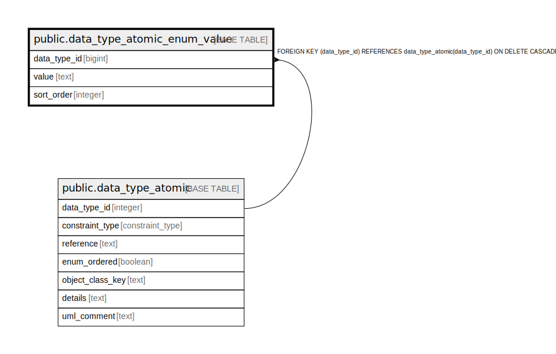

# public.data_type_atomic_enum_value

## Description

A value of an attribute that is an enum.

## Columns

| Name | Type | Default | Nullable | Children | Parents | Comment |
| ---- | ---- | ------- | -------- | -------- | ------- | ------- |
| data_type_id | bigint |  | false |  | [public.data_type_atomic](public.data_type_atomic.md) | The atomic data type this is a value for. |
| value | text |  | false |  |  | The enum value. |
| sort_order | integer |  | false |  |  | A value for keeping presentation clear in documentation. |

## Constraints

| Name | Type | Definition |
| ---- | ---- | ---------- |
| fk_enum_atomic | FOREIGN KEY | FOREIGN KEY (data_type_id) REFERENCES data_type_atomic(data_type_id) ON DELETE CASCADE |
| data_type_atomic_enum_value_pkey | PRIMARY KEY | PRIMARY KEY (data_type_id, value) |

## Indexes

| Name | Definition |
| ---- | ---------- |
| data_type_atomic_enum_value_pkey | CREATE UNIQUE INDEX data_type_atomic_enum_value_pkey ON public.data_type_atomic_enum_value USING btree (data_type_id, value) |

## Relations

---

> Generated by [tbls](https://github.com/k1LoW/tbls)
