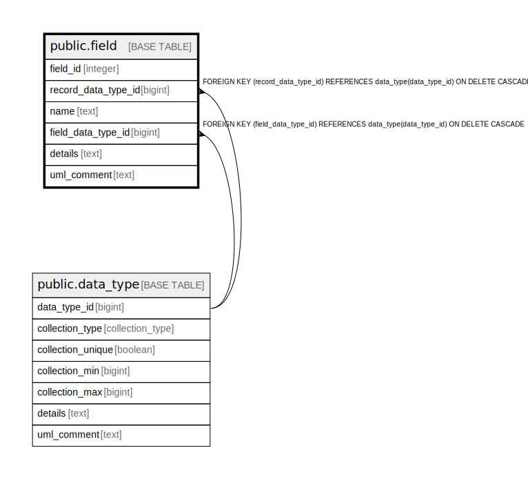

# public.field

## Description

A field of a record data type.

## Columns

| Name | Type | Default | Nullable | Children | Parents | Comment |
| ---- | ---- | ------- | -------- | -------- | ------- | ------- |
| field_id | integer | nextval('field_field_id_seq'::regclass) | false |  |  | The internal ID. |
| record_data_type_id | bigint |  | false |  | [public.data_type](public.data_type.md) | The parent record this field is part of. |
| name | text |  | false |  |  | The unique name of the field within the data type. |
| field_data_type_id | bigint |  | false |  | [public.data_type](public.data_type.md) | The data type of this field. |
| details | text |  | true |  |  | A summary description. |
| uml_comment | text |  | true |  |  | A comment that appears in the diagrams. |

## Constraints

| Name | Type | Definition |
| ---- | ---- | ---------- |
| fk_field_record | FOREIGN KEY | FOREIGN KEY (record_data_type_id) REFERENCES data_type(data_type_id) ON DELETE CASCADE |
| fk_field_type | FOREIGN KEY | FOREIGN KEY (field_data_type_id) REFERENCES data_type(data_type_id) ON DELETE CASCADE |
| field_pkey | PRIMARY KEY | PRIMARY KEY (field_id) |

## Indexes

| Name | Definition |
| ---- | ---------- |
| field_pkey | CREATE UNIQUE INDEX field_pkey ON public.field USING btree (field_id) |

## Relations

---

> Generated by [tbls](https://github.com/k1LoW/tbls)
