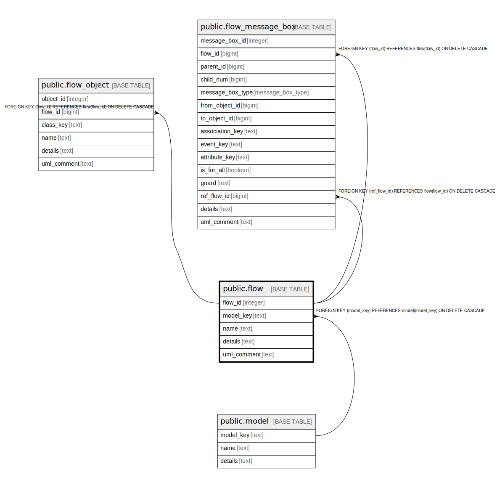

# public.flow

## Description

A documentated flow of data/communication for the system. And integration diagram.

## Columns

| Name | Type | Default | Nullable | Children | Parents | Comment |
| ---- | ---- | ------- | -------- | -------- | ------- | ------- |
| flow_id | integer | nextval('flow_flow_id_seq'::regclass) | false | [public.flow_object](public.flow_object.md) [public.flow_message_box](public.flow_message_box.md) |  | The internal ID. |
| model_key | text |  | false |  | [public.model](public.model.md) | The model this flow is part of. |
| name | text |  | false |  |  | The unique name of the flow. |
| details | text |  | true |  |  | A summary description. |
| uml_comment | text |  | true |  |  | A comment that appears in the diagrams. |

## Constraints

| Name | Type | Definition |
| ---- | ---- | ---------- |
| fk_flow_model | FOREIGN KEY | FOREIGN KEY (model_key) REFERENCES model(model_key) ON DELETE CASCADE |
| flow_pkey | PRIMARY KEY | PRIMARY KEY (flow_id) |

## Indexes

| Name | Definition |
| ---- | ---------- |
| flow_pkey | CREATE UNIQUE INDEX flow_pkey ON public.flow USING btree (flow_id) |

## Relations

---

> Generated by [tbls](https://github.com/k1LoW/tbls)
