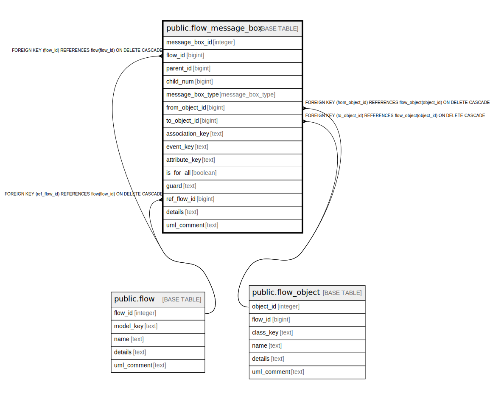

# public.flow_message_box

## Description

A flow tracks message between objects.  
The messages must pass over an association between the two classes of the objects.  
A row could also be a box containing other boxes and messages.

## Columns

| Name | Type | Default | Nullable | Children | Parents | Comment |
| ---- | ---- | ------- | -------- | -------- | ------- | ------- |
| message_box_id | integer | nextval('flow_message_box_message_box_id_seq'::regclass) | false |  |  | The internal ID. |
| flow_id | bigint |  | false |  | [public.flow](public.flow.md) | The flow this message is part of. |
| parent_id | bigint |  | true |  |  | The parent (this is a tree of data). Root elements have a NULL parent. |
| child_num | bigint |  | false |  |  | The order of this element in this level of the diagram. |
| message_box_type | message_box_type |  | false |  |  | The kind of message or box this is. |
| from_object_id | bigint |  | true |  | [public.flow_object](public.flow_object.md) | The flow object this message is from. |
| to_object_id | bigint |  | true |  | [public.flow_object](public.flow_object.md) | The flow object this message is to. |
| association_key | text |  | true |  |  | Two objects must pass a message over an association between classes. |
| event_key | text |  | true |  |  | If the message is an event, which event. |
| attribute_key | text |  | true |  |  | If the message is an attribute, which attribute. |
| is_for_all | boolean |  | true |  |  | If the message sent to many children of the same object. |
| guard | text |  | true |  |  | The conditional statement. |
| ref_flow_id | bigint |  | true |  | [public.flow](public.flow.md) | The flow that is internal to this flow.. |
| details | text |  | true |  |  | A summary description. |
| uml_comment | text |  | true |  |  | A comment that appears in the diagrams. |

## Constraints

| Name | Type | Definition |
| ---- | ---- | ---------- |
| fk_message_box_flow | FOREIGN KEY | FOREIGN KEY (flow_id) REFERENCES flow(flow_id) ON DELETE CASCADE |
| fk_message_box_ref | FOREIGN KEY | FOREIGN KEY (ref_flow_id) REFERENCES flow(flow_id) ON DELETE CASCADE |
| fk_message_box_from | FOREIGN KEY | FOREIGN KEY (from_object_id) REFERENCES flow_object(object_id) ON DELETE CASCADE |
| fk_message_box_to | FOREIGN KEY | FOREIGN KEY (to_object_id) REFERENCES flow_object(object_id) ON DELETE CASCADE |
| flow_message_box_pkey | PRIMARY KEY | PRIMARY KEY (message_box_id) |
| flow_message_box_flow_id_parent_id_child_num_key | UNIQUE | UNIQUE (flow_id, parent_id, child_num) |

## Indexes

| Name | Definition |
| ---- | ---------- |
| flow_message_box_pkey | CREATE UNIQUE INDEX flow_message_box_pkey ON public.flow_message_box USING btree (message_box_id) |
| flow_message_box_flow_id_parent_id_child_num_key | CREATE UNIQUE INDEX flow_message_box_flow_id_parent_id_child_num_key ON public.flow_message_box USING btree (flow_id, parent_id, child_num) |

## Relations

---

> Generated by [tbls](https://github.com/k1LoW/tbls)
