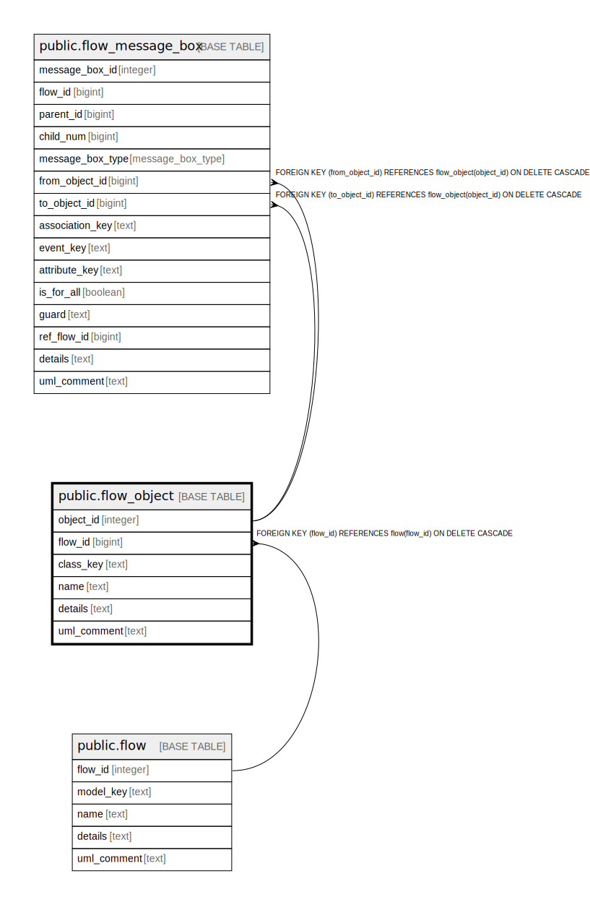

# public.flow_object

## Description

An object of a flow.

## Columns

| Name | Type | Default | Nullable | Children | Parents | Comment |
| ---- | ---- | ------- | -------- | -------- | ------- | ------- |
| object_id | integer | nextval('flow_object_object_id_seq'::regclass) | false | [public.flow_message_box](public.flow_message_box.md) |  | The internal ID. |
| flow_id | bigint |  | false |  | [public.flow](public.flow.md) | The flow this object is part of. |
| class_key | text |  | false |  |  | The kind of object this is. |
| name | text |  | false |  |  | The unique name of the flow. |
| details | text |  | true |  |  | A summary description. |
| uml_comment | text |  | true |  |  | A comment that appears in the diagrams. |

## Constraints

| Name | Type | Definition |
| ---- | ---- | ---------- |
| fk_object_flow | FOREIGN KEY | FOREIGN KEY (flow_id) REFERENCES flow(flow_id) ON DELETE CASCADE |
| flow_object_pkey | PRIMARY KEY | PRIMARY KEY (object_id) |

## Indexes

| Name | Definition |
| ---- | ---------- |
| flow_object_pkey | CREATE UNIQUE INDEX flow_object_pkey ON public.flow_object USING btree (object_id) |

## Relations

---

> Generated by [tbls](https://github.com/k1LoW/tbls)
