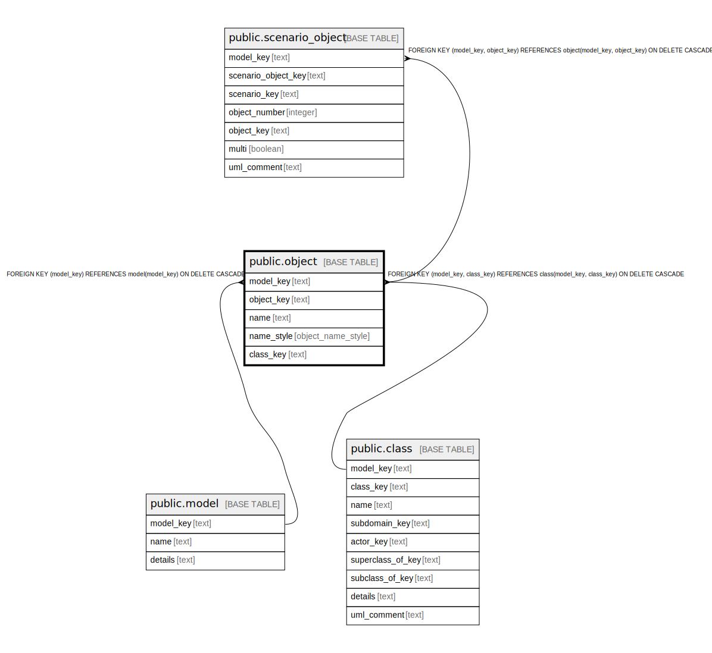

# public.object

## Description

An object that participates in a scenario, such as a sequence diagram or activity diagram.

## Columns

| Name | Type | Default | Nullable | Children | Parents | Comment |
| ---- | ---- | ------- | -------- | -------- | ------- | ------- |
| model_key | text |  | false | [public.scenario_object](public.scenario_object.md) | [public.model](public.model.md) [public.class](public.class.md) | The model this scenario object is part of. |
| object_key | text |  | false | [public.scenario_object](public.scenario_object.md) |  | The internal ID. |
| name | text |  | false |  |  | The name of the scenario object. |
| name_style | object_name_style |  | false |  |  | How the name is displayed in the diagram. |
| class_key | text |  | false |  | [public.class](public.class.md) | The class this scenario object is an instance of. |

## Constraints

| Name | Type | Definition |
| ---- | ---- | ---------- |
| fk_object_model | FOREIGN KEY | FOREIGN KEY (model_key) REFERENCES model(model_key) ON DELETE CASCADE |
| fk_object_class | FOREIGN KEY | FOREIGN KEY (model_key, class_key) REFERENCES class(model_key, class_key) ON DELETE CASCADE |
| object_pkey | PRIMARY KEY | PRIMARY KEY (model_key, object_key) |

## Indexes

| Name | Definition |
| ---- | ---------- |
| object_pkey | CREATE UNIQUE INDEX object_pkey ON public.object USING btree (model_key, object_key) |

## Relations

---

> Generated by [tbls](https://github.com/k1LoW/tbls)
