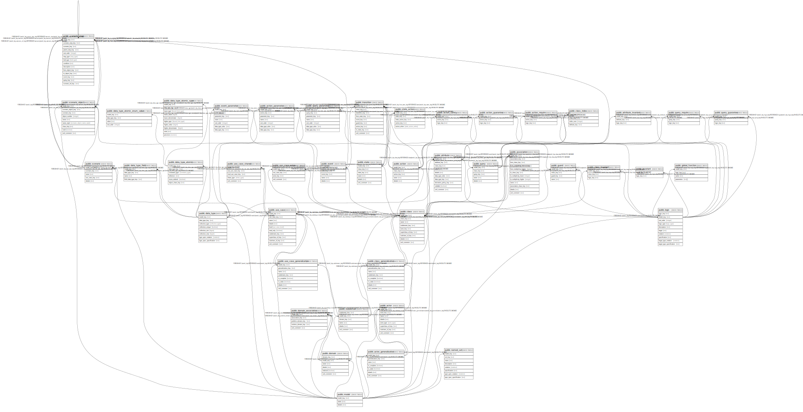

# postgres

## Tables

| Name | Columns | Comment | Type |
| ---- | ------- | ------- | ---- |
| [public.model](public.model.md) | 3 | A fully distinct semantic model, separate from all others. | BASE TABLE |
| [public.logic](public.logic.md) | 5 | A bit of business logic. | BASE TABLE |
| [public.invariant](public.invariant.md) | 2 | An invariant that is forever true in the model. | BASE TABLE |
| [public.global_function](public.global_function.md) | 5 | An global function used to describe simulation and code generation. | BASE TABLE |
| [public.domain](public.domain.md) | 6 | A bucket for parts of a model. | BASE TABLE |
| [public.subdomain](public.subdomain.md) | 6 | A bucket for parts of a model. | BASE TABLE |
| [public.domain_association](public.domain_association.md) | 5 | A semantic relationship between two domains. | BASE TABLE |
| [public.actor_generalization](public.actor_generalization.md) | 7 | A relationship between actors indicating super classes and subclasses. | BASE TABLE |
| [public.actor](public.actor.md) | 8 | A role that a person or sytem can take who uses the system. Actors are outside of subdomains. | BASE TABLE |
| [public.data_type](public.data_type.md) | 6 | An data type for use in a class attribute or action parameter. | BASE TABLE |
| [public.data_type_atomic](public.data_type_atomic.md) | 6 | An atomic type that backs a data type for eventually use in a class attribute or action parameter. | BASE TABLE |
| [public.data_type_atomic_enum_value](public.data_type_atomic_enum_value.md) | 4 | A value of an attribute that is an enum. | BASE TABLE |
| [public.data_type_atomic_span](public.data_type_atomic_span.md) | 10 | The definition of a span for an atomic data type. | BASE TABLE |
| [public.data_type_field](public.data_type_field.md) | 4 | A field of a record data type. | BASE TABLE |
| [public.class_generalization](public.class_generalization.md) | 8 | A relationship between classes indicating super classes and subclasses. | BASE TABLE |
| [public.class](public.class.md) | 9 | A set of objects that share the same semantics. | BASE TABLE |
| [public.attribute](public.attribute.md) | 10 | An attribute of a class. | BASE TABLE |
| [public.class_index](public.class_index.md) | 4 | A unique identity for a class, may be mulitple attributes together for the identity. | BASE TABLE |
| [public.association](public.association.md) | 12 | A semantic relationship between typed instances. | BASE TABLE |
| [public.query](public.query.md) | 5 | An business logic query of a class that does not change the state of a class. | BASE TABLE |
| [public.query_parameter](public.query_parameter.md) | 7 | A parameter of a query. | BASE TABLE |
| [public.query_require](public.query_require.md) | 3 | A state requirement that must be true for this query to be run. | BASE TABLE |
| [public.query_guarantee](public.query_guarantee.md) | 3 | A guarantee of what is returned by this query. | BASE TABLE |
| [public.state](public.state.md) | 6 | A situation where invariant conditions on a class instance hold. | BASE TABLE |
| [public.event](public.event.md) | 5 | Some occurence that can potentially trigger a change in and instance. | BASE TABLE |
| [public.event_parameter](public.event_parameter.md) | 7 | A parameter of an event. | BASE TABLE |
| [public.guard](public.guard.md) | 4 | An extra condition on when the transition can take place. | BASE TABLE |
| [public.action](public.action.md) | 5 | An action of a class that can be attached to transitions. | BASE TABLE |
| [public.action_parameter](public.action_parameter.md) | 7 | A parameter of a action. | BASE TABLE |
| [public.action_require](public.action_require.md) | 3 | A state requirement that must be true for this action to be run. | BASE TABLE |
| [public.action_guarantee](public.action_guarantee.md) | 3 | A guarantee of what is returned by this action. | BASE TABLE |
| [public.action_safety](public.action_safety.md) | 3 | A safety rule check of before and after state that fails if the model is in an incorrect state. | BASE TABLE |
| [public.transition](public.transition.md) | 9 | The movement between states. | BASE TABLE |
| [public.state_action](public.state_action.md) | 5 | An action triggered on entry, exit, or continual do from a state. | BASE TABLE |
| [public.use_case_generalization](public.use_case_generalization.md) | 8 | A relationship between use cases indicating super classes and subclasses. | BASE TABLE |
| [public.use_case](public.use_case.md) | 10 | A sequence of steps in the business rules. | BASE TABLE |
| [public.use_case_actor](public.use_case_actor.md) | 4 | Which actors participate in which use cases. | BASE TABLE |
| [public.use_case_shared](public.use_case_shared.md) | 5 | Which use cases are used by with other use cases. | BASE TABLE |
| [public.scenario](public.scenario.md) | 5 | A documented scenario, such as a sequence diagram or activity diagram, for a use case. | BASE TABLE |
| [public.scenario_object](public.scenario_object.md) | 9 | An object that participates in a scenario. | BASE TABLE |
| [public.scenario_step](public.scenario_step.md) | 14 | A step of a scenario, all the steps in a scenario form a tree. | BASE TABLE |

## Enums

| Name | Values |
| ---- | ------- |
| public.actor_type | person, system |
| public.bound_limit_type | closed, open, unconstrained |
| public.collection_type | atomic, ordered, queue, record, stack, unordered |
| public.constraint_type | enumeration, object, reference, span, unconstrained |
| public.leaf_type | delete, event, query, scenario |
| public.notation | tla_plus |
| public.scenario_object_name_style | id, name, unnamed |
| public.share_type | extend, include |
| public.state_action_when | do, entry, exit |
| public.step_type | case, leaf, loop, sequence, switch |
| public.use_case_level | mud, sea, sky |

## Relations

---

> Generated by [tbls](https://github.com/k1LoW/tbls)
