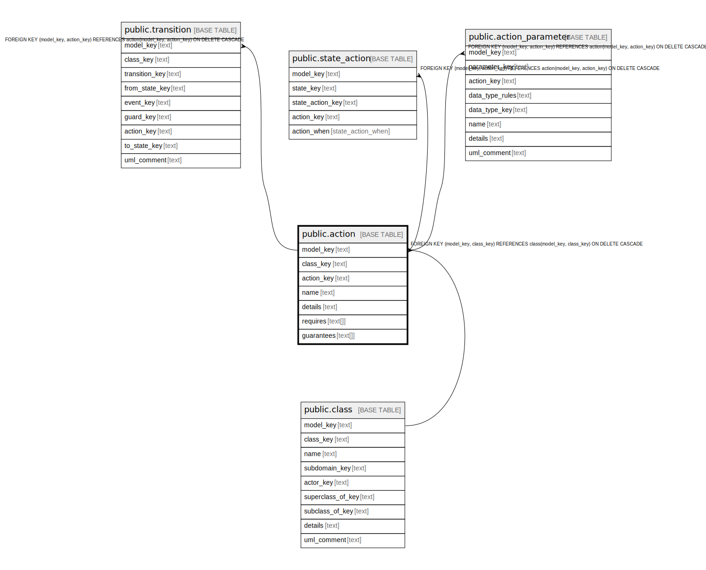

# public.action

## Description

An action of a class that can be attached to transitions.

## Columns

| Name | Type | Default | Nullable | Children | Parents | Comment |
| ---- | ---- | ------- | -------- | -------- | ------- | ------- |
| model_key | text |  | false | [public.action_parameter](public.action_parameter.md) [public.action_require](public.action_require.md) [public.action_guarantee](public.action_guarantee.md) [public.action_safety](public.action_safety.md) [public.transition](public.transition.md) [public.state_action](public.state_action.md) | [public.class](public.class.md) | The model this state machine is part of. |
| class_key | text |  | false |  | [public.class](public.class.md) | The class this action is part of. |
| action_key | text |  | false | [public.action_parameter](public.action_parameter.md) [public.action_require](public.action_require.md) [public.action_guarantee](public.action_guarantee.md) [public.action_safety](public.action_safety.md) [public.transition](public.transition.md) [public.state_action](public.state_action.md) |  | The internal ID. |
| name | text |  | false |  |  | The unique name of the action within the class. |
| details | text |  | true |  |  | A summary description. |

## Constraints

| Name | Type | Definition |
| ---- | ---- | ---------- |
| action_action_key_not_null | n | NOT NULL action_key |
| action_class_key_not_null | n | NOT NULL class_key |
| action_model_key_not_null | n | NOT NULL model_key |
| action_name_not_null | n | NOT NULL name |
| fk_action_class | FOREIGN KEY | FOREIGN KEY (model_key, class_key) REFERENCES class(model_key, class_key) ON DELETE CASCADE |
| action_pkey | PRIMARY KEY | PRIMARY KEY (model_key, action_key) |

## Indexes

| Name | Definition |
| ---- | ---------- |
| action_pkey | CREATE UNIQUE INDEX action_pkey ON public.action USING btree (model_key, action_key) |

## Relations

---

> Generated by [tbls](https://github.com/k1LoW/tbls)
