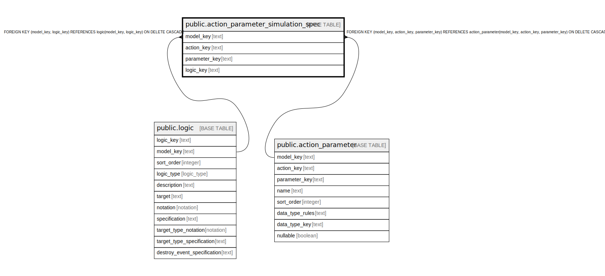

# public.action_parameter_simulation_spec

## Description

Simulator-only value expression for sampling an action parameter.

## Columns

| Name | Type | Default | Nullable | Children | Parents | Comment |
| ---- | ---- | ------- | -------- | -------- | ------- | ------- |
| model_key | text |  | false |  | [public.logic](public.logic.md) [public.action_parameter](public.action_parameter.md) | The model this join row belongs to. |
| action_key | text |  | false |  | [public.action_parameter](public.action_parameter.md) | The action that owns the parameter. |
| parameter_key | text |  | false |  | [public.action_parameter](public.action_parameter.md) | The parameter subkey. |
| logic_key | text |  | false |  | [public.logic](public.logic.md) | Value logic that evaluates to the sampled parameter value. |

## Constraints

| Name | Type | Definition |
| ---- | ---- | ---------- |
| action_parameter_simulation_spec_action_key_not_null | n | NOT NULL action_key |
| action_parameter_simulation_spec_logic_key_not_null | n | NOT NULL logic_key |
| action_parameter_simulation_spec_model_key_not_null | n | NOT NULL model_key |
| action_parameter_simulation_spec_parameter_key_not_null | n | NOT NULL parameter_key |
| fk_action_param_sim_spec_logic | FOREIGN KEY | FOREIGN KEY (model_key, logic_key) REFERENCES logic(model_key, logic_key) ON DELETE CASCADE |
| fk_action_param_sim_spec_parameter | FOREIGN KEY | FOREIGN KEY (model_key, action_key, parameter_key) REFERENCES action_parameter(model_key, action_key, parameter_key) ON DELETE CASCADE |
| action_parameter_simulation_spec_pkey | PRIMARY KEY | PRIMARY KEY (model_key, action_key, parameter_key) |

## Indexes

| Name | Definition |
| ---- | ---------- |
| action_parameter_simulation_spec_pkey | CREATE UNIQUE INDEX action_parameter_simulation_spec_pkey ON public.action_parameter_simulation_spec USING btree (model_key, action_key, parameter_key) |

## Relations

---

> Generated by [tbls](https://github.com/k1LoW/tbls)
