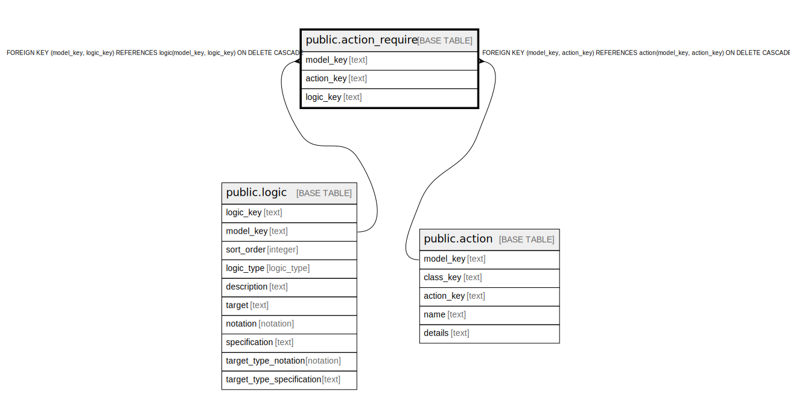

# public.action_require

## Description

A state requirement that must be true for this action to be run.

## Columns

| Name | Type | Default | Nullable | Children | Parents | Comment |
| ---- | ---- | ------- | -------- | -------- | ------- | ------- |
| model_key | text |  | false |  | [public.logic](public.logic.md) [public.action](public.action.md) | The model this require is part of. |
| action_key | text |  | false |  | [public.action](public.action.md) | The action this require is part of. |
| logic_key | text |  | false |  | [public.logic](public.logic.md) | The logic of the require. |

## Constraints

| Name | Type | Definition |
| ---- | ---- | ---------- |
| action_require_action_key_not_null | n | NOT NULL action_key |
| action_require_logic_key_not_null | n | NOT NULL logic_key |
| action_require_model_key_not_null | n | NOT NULL model_key |
| fk_action_require_logic | FOREIGN KEY | FOREIGN KEY (model_key, logic_key) REFERENCES logic(model_key, logic_key) ON DELETE CASCADE |
| fk_action_require_action | FOREIGN KEY | FOREIGN KEY (model_key, action_key) REFERENCES action(model_key, action_key) ON DELETE CASCADE |
| action_require_pkey | PRIMARY KEY | PRIMARY KEY (model_key, action_key, logic_key) |

## Indexes

| Name | Definition |
| ---- | ---------- |
| action_require_pkey | CREATE UNIQUE INDEX action_require_pkey ON public.action_require USING btree (model_key, action_key, logic_key) |

## Relations

---

> Generated by [tbls](https://github.com/k1LoW/tbls)
