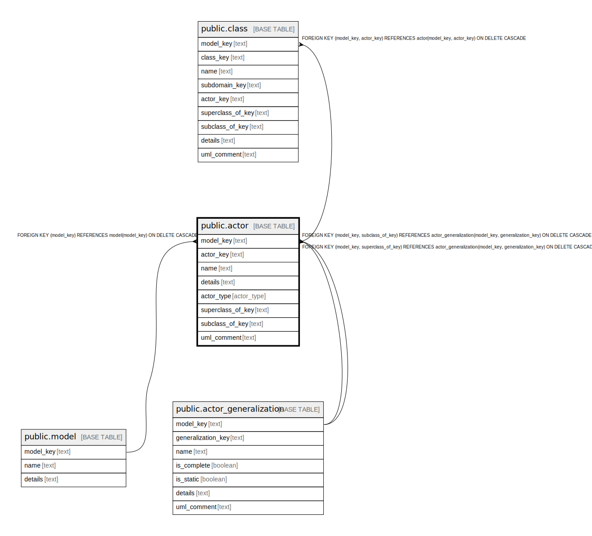

# public.actor

## Description

A role that a person or sytem can take who uses the system. Actors are outside of subdomains.

## Columns

| Name | Type | Default | Nullable | Children | Parents | Comment |
| ---- | ---- | ------- | -------- | -------- | ------- | ------- |
| model_key | text |  | false | [public.class](public.class.md) | [public.model](public.model.md) | The model this actor is part of. |
| actor_key | text |  | false | [public.class](public.class.md) |  | The internal ID. |
| name | text |  | false |  |  | The unique name of the actor. |
| details | text |  | true |  |  | A summary description. |
| actor_type | actor_type |  | false |  |  | Whether this actor is a person or a system. |
| uml_comment | text |  | true |  |  | A comment that appears in the diagrams. |

## Constraints

| Name | Type | Definition |
| ---- | ---- | ---------- |
| actor_actor_key_not_null | n | NOT NULL actor_key |
| actor_actor_type_not_null | n | NOT NULL actor_type |
| actor_model_key_not_null | n | NOT NULL model_key |
| actor_name_not_null | n | NOT NULL name |
| fk_actor_model | FOREIGN KEY | FOREIGN KEY (model_key) REFERENCES model(model_key) ON DELETE CASCADE |
| actor_pkey | PRIMARY KEY | PRIMARY KEY (model_key, actor_key) |

## Indexes

| Name | Definition |
| ---- | ---------- |
| actor_pkey | CREATE UNIQUE INDEX actor_pkey ON public.actor USING btree (model_key, actor_key) |

## Relations

---

> Generated by [tbls](https://github.com/k1LoW/tbls)
