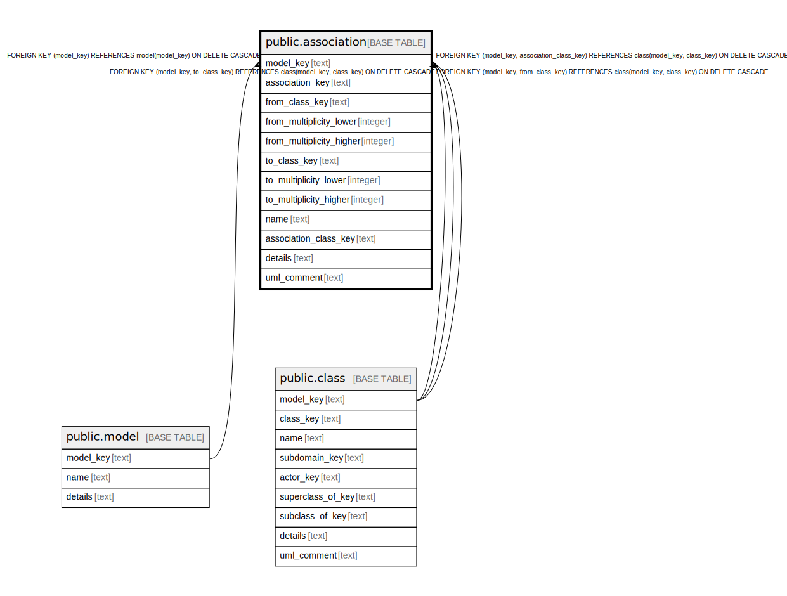

# public.association

## Description

A semantic relationship between typed instances.

## Columns

| Name | Type | Default | Nullable | Children | Parents | Comment |
| ---- | ---- | ------- | -------- | -------- | ------- | ------- |
| model_key | text |  | false |  | [public.model](public.model.md) [public.class](public.class.md) | The model this association is part of. |
| association_key | text |  | false |  |  | The internal ID. |
| from_class_key | text |  | false |  | [public.class](public.class.md) | The away-from direction of the association, for depicting tacochip. |
| from_multiplicity_lower | integer |  | false |  |  | The multiplicity of the from end of the relation, lower value, 0 means "any". |
| from_multiplicity_higher | integer |  | false |  |  | The multiplicity of the from end of the relation, higher value, 0 means "any". |
| to_class_key | text |  | false |  | [public.class](public.class.md) | The toward direction of the association, for depicting tacochip. |
| to_multiplicity_lower | integer |  | false |  |  | The multiplicity of the to end of the relation, lower value, 0 means "any". |
| to_multiplicity_higher | integer |  | false |  |  | The multiplicity of the to end of the relation, higher value, 0 means "any". |
| name | text |  | false |  |  | The relationship name next to the taco chip. |
| association_class_key | text |  | true |  | [public.class](public.class.md) | If thiere is a class for for this association, what is it. |
| details | text |  | true |  |  | A summary description. |
| uml_comment | text |  | true |  |  | A comment that appears in the diagrams. |

## Constraints

| Name | Type | Definition |
| ---- | ---- | ---------- |
| association_association_key_not_null | n | NOT NULL association_key |
| association_from_class_key_not_null | n | NOT NULL from_class_key |
| association_from_multiplicity_higher_not_null | n | NOT NULL from_multiplicity_higher |
| association_from_multiplicity_lower_not_null | n | NOT NULL from_multiplicity_lower |
| association_model_key_not_null | n | NOT NULL model_key |
| association_name_not_null | n | NOT NULL name |
| association_to_class_key_not_null | n | NOT NULL to_class_key |
| association_to_multiplicity_higher_not_null | n | NOT NULL to_multiplicity_higher |
| association_to_multiplicity_lower_not_null | n | NOT NULL to_multiplicity_lower |
| fk_association_model | FOREIGN KEY | FOREIGN KEY (model_key) REFERENCES model(model_key) ON DELETE CASCADE |
| fk_association_class | FOREIGN KEY | FOREIGN KEY (model_key, association_class_key) REFERENCES class(model_key, class_key) ON DELETE CASCADE |
| fk_association_from | FOREIGN KEY | FOREIGN KEY (model_key, from_class_key) REFERENCES class(model_key, class_key) ON DELETE CASCADE |
| fk_association_to | FOREIGN KEY | FOREIGN KEY (model_key, to_class_key) REFERENCES class(model_key, class_key) ON DELETE CASCADE |
| association_pkey | PRIMARY KEY | PRIMARY KEY (model_key, association_key) |

## Indexes

| Name | Definition |
| ---- | ---------- |
| association_pkey | CREATE UNIQUE INDEX association_pkey ON public.association USING btree (model_key, association_key) |

## Relations

---

> Generated by [tbls](https://github.com/k1LoW/tbls)
