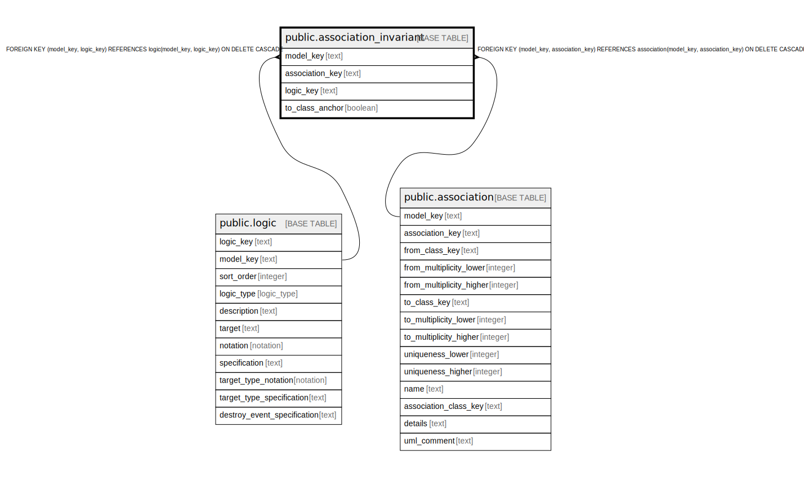

# public.association_invariant

## Description

Join table linking class associations to their invariant logic predicates.

## Columns

| Name | Type | Default | Nullable | Children | Parents | Comment |
| ---- | ---- | ------- | -------- | -------- | ------- | ------- |
| model_key | text |  | false |  | [public.logic](public.logic.md) [public.association](public.association.md) | The model this association invariant belongs to. |
| association_key | text |  | false |  | [public.association](public.association.md) | The association this invariant constrains. |
| logic_key | text |  | false |  | [public.logic](public.logic.md) | The logic predicate that must hold for the association link set. |
| to_class_anchor | boolean | false | false |  |  | True when the invariant is anchored on the association to-class rather than the default from-class. |

## Constraints

| Name | Type | Definition |
| ---- | ---- | ---------- |
| association_invariant_association_key_not_null | n | NOT NULL association_key |
| association_invariant_logic_key_not_null | n | NOT NULL logic_key |
| association_invariant_model_key_not_null | n | NOT NULL model_key |
| association_invariant_to_class_anchor_not_null | n | NOT NULL to_class_anchor |
| fk_assoc_invariant_logic | FOREIGN KEY | FOREIGN KEY (model_key, logic_key) REFERENCES logic(model_key, logic_key) ON DELETE CASCADE |
| fk_assoc_invariant_association | FOREIGN KEY | FOREIGN KEY (model_key, association_key) REFERENCES association(model_key, association_key) ON DELETE CASCADE |
| association_invariant_pkey | PRIMARY KEY | PRIMARY KEY (model_key, association_key, logic_key) |

## Indexes

| Name | Definition |
| ---- | ---------- |
| association_invariant_pkey | CREATE UNIQUE INDEX association_invariant_pkey ON public.association_invariant USING btree (model_key, association_key, logic_key) |

## Relations

---

> Generated by [tbls](https://github.com/k1LoW/tbls)
