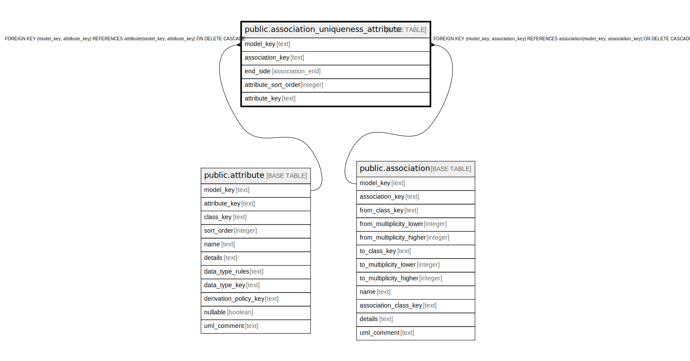

# public.association_uniqueness_attribute

## Description

Attributes that form one side of an association uniqueness tuple.

## Columns

| Name | Type | Default | Nullable | Children | Parents | Comment |
| ---- | ---- | ------- | -------- | -------- | ------- | ------- |
| model_key | text |  | false |  | [public.attribute](public.attribute.md) [public.association](public.association.md) |  |
| association_key | text |  | false |  | [public.association](public.association.md) |  |
| end_side | association_end |  | false |  |  | Whether the attribute belongs to the from or to endpoint class. |
| attribute_sort_order | integer |  | false |  |  | Order of this attribute within the from or to tuple. |
| attribute_key | text |  | false |  | [public.attribute](public.attribute.md) | The endpoint-class attribute that contributes to the uniqueness tuple. |

## Constraints

| Name | Type | Definition |
| ---- | ---- | ---------- |
| association_uniqueness_attribute_association_key_not_null | n | NOT NULL association_key |
| association_uniqueness_attribute_attribute_key_not_null | n | NOT NULL attribute_key |
| association_uniqueness_attribute_attribute_sort_order_not_null | n | NOT NULL attribute_sort_order |
| association_uniqueness_attribute_end_side_not_null | n | NOT NULL end_side |
| association_uniqueness_attribute_model_key_not_null | n | NOT NULL model_key |
| fk_assoc_uniq_attr_attribute | FOREIGN KEY | FOREIGN KEY (model_key, attribute_key) REFERENCES attribute(model_key, attribute_key) ON DELETE CASCADE |
| fk_assoc_uniq_attr_association | FOREIGN KEY | FOREIGN KEY (model_key, association_key) REFERENCES association(model_key, association_key) ON DELETE CASCADE |
| association_uniqueness_attribute_pkey | PRIMARY KEY | PRIMARY KEY (model_key, association_key, end_side, attribute_sort_order) |

## Indexes

| Name | Definition |
| ---- | ---------- |
| association_uniqueness_attribute_pkey | CREATE UNIQUE INDEX association_uniqueness_attribute_pkey ON public.association_uniqueness_attribute USING btree (model_key, association_key, end_side, attribute_sort_order) |

## Relations

---

> Generated by [tbls](https://github.com/k1LoW/tbls)
