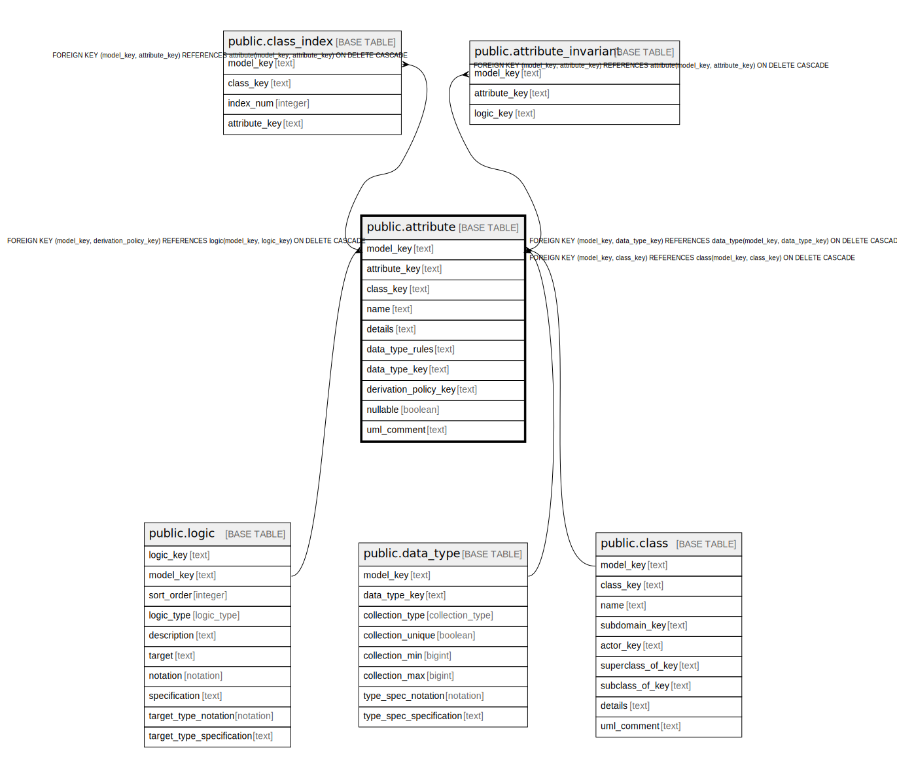

# public.attribute

## Description

An attribute of a class.

## Columns

| Name | Type | Default | Nullable | Children | Parents | Comment |
| ---- | ---- | ------- | -------- | -------- | ------- | ------- |
| model_key | text |  | false | [public.class_index](public.class_index.md) | [public.logic](public.logic.md) [public.data_type](public.data_type.md) [public.class](public.class.md) | The model this class attribute is part of. |
| attribute_key | text |  | false | [public.class_index](public.class_index.md) |  | The internal ID. |
| class_key | text |  | false |  | [public.class](public.class.md) | The class this attribute is part of. |
| name | text |  | false |  |  | The unique name of the attribute within the class. |
| details | text |  | true |  |  | A summary description. |
| data_type_rules | text |  | true |  |  | The rules for a well-formed value. |
| data_type_key | text |  | true |  | [public.data_type](public.data_type.md) | If the rules are parsable, the data type they parse into. |
| derivation_policy_key | text |  | true |  | [public.logic](public.logic.md) | If this attribute is derived, the logic of it. |
| nullable | boolean |  | false |  |  | A nullable attribute is one that only humans have to deal with, not software. Should not be used in a sea-level use case. Example: a missing phone number on a contact page. |
| uml_comment | text |  | true |  |  | A comment that appears in the diagrams. |

## Constraints

| Name | Type | Definition |
| ---- | ---- | ---------- |
| attribute_attribute_key_not_null | n | NOT NULL attribute_key |
| attribute_class_key_not_null | n | NOT NULL class_key |
| attribute_model_key_not_null | n | NOT NULL model_key |
| attribute_name_not_null | n | NOT NULL name |
| attribute_nullable_not_null | n | NOT NULL nullable |
| fk_attribute_derivation_logic | FOREIGN KEY | FOREIGN KEY (model_key, derivation_policy_key) REFERENCES logic(model_key, logic_key) ON DELETE CASCADE |
| fk_attribute_data_type | FOREIGN KEY | FOREIGN KEY (model_key, data_type_key) REFERENCES data_type(model_key, data_type_key) ON DELETE CASCADE |
| fk_attribute_class | FOREIGN KEY | FOREIGN KEY (model_key, class_key) REFERENCES class(model_key, class_key) ON DELETE CASCADE |
| attribute_pkey | PRIMARY KEY | PRIMARY KEY (model_key, attribute_key) |

## Indexes

| Name | Definition |
| ---- | ---------- |
| attribute_pkey | CREATE UNIQUE INDEX attribute_pkey ON public.attribute USING btree (model_key, attribute_key) |

## Relations

---

> Generated by [tbls](https://github.com/k1LoW/tbls)
