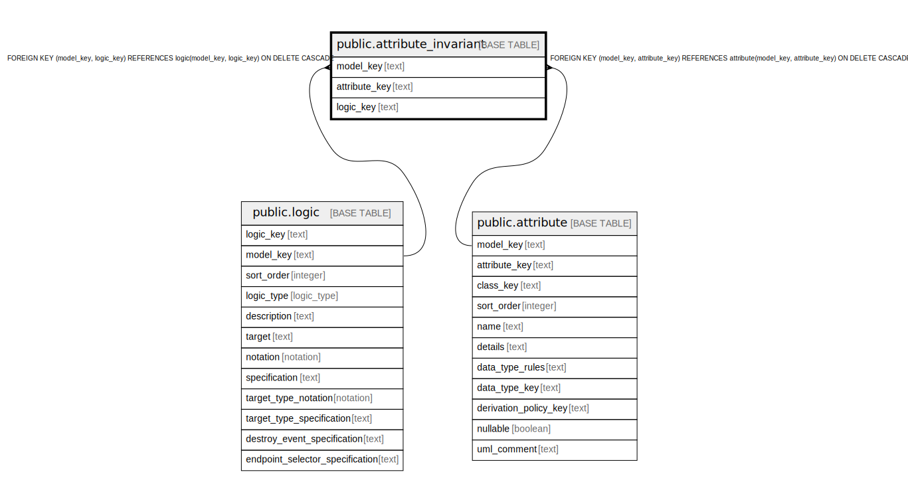

# public.attribute_invariant

## Description

Join table linking attributes to their invariant logic predicates.

## Columns

| Name | Type | Default | Nullable | Children | Parents | Comment |
| ---- | ---- | ------- | -------- | -------- | ------- | ------- |
| model_key | text |  | false |  | [public.logic](public.logic.md) [public.attribute](public.attribute.md) | The model this attribute invariant belongs to. |
| attribute_key | text |  | false |  | [public.attribute](public.attribute.md) | The attribute this invariant constrains. |
| logic_key | text |  | false |  | [public.logic](public.logic.md) | The logic predicate that must hold for the attribute value. |

## Constraints

| Name | Type | Definition |
| ---- | ---- | ---------- |
| attribute_invariant_attribute_key_not_null | n | NOT NULL attribute_key |
| attribute_invariant_logic_key_not_null | n | NOT NULL logic_key |
| attribute_invariant_model_key_not_null | n | NOT NULL model_key |
| fk_attr_invariant_logic | FOREIGN KEY | FOREIGN KEY (model_key, logic_key) REFERENCES logic(model_key, logic_key) ON DELETE CASCADE |
| fk_attr_invariant_attribute | FOREIGN KEY | FOREIGN KEY (model_key, attribute_key) REFERENCES attribute(model_key, attribute_key) ON DELETE CASCADE |
| attribute_invariant_pkey | PRIMARY KEY | PRIMARY KEY (model_key, attribute_key, logic_key) |

## Indexes

| Name | Definition |
| ---- | ---------- |
| attribute_invariant_pkey | CREATE UNIQUE INDEX attribute_invariant_pkey ON public.attribute_invariant USING btree (model_key, attribute_key, logic_key) |

## Relations

---

> Generated by [tbls](https://github.com/k1LoW/tbls)
