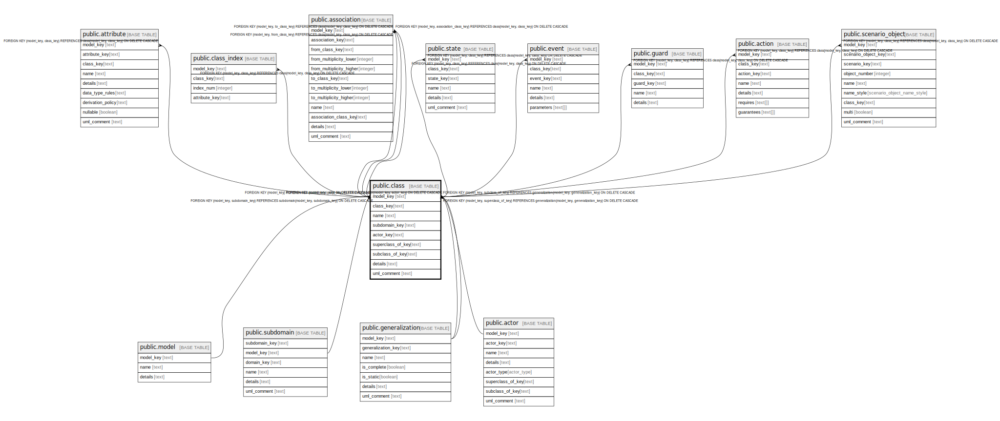

# public.class

## Description

A set of objects that share the same semantics.

## Columns

| Name | Type | Default | Nullable | Children | Parents | Comment |
| ---- | ---- | ------- | -------- | -------- | ------- | ------- |
| model_key | text |  | false | [public.attribute](public.attribute.md) [public.class_index](public.class_index.md) [public.class_invariant](public.class_invariant.md) [public.association](public.association.md) [public.query](public.query.md) [public.state](public.state.md) [public.event](public.event.md) [public.guard](public.guard.md) [public.action](public.action.md) [public.use_case_actor](public.use_case_actor.md) [public.scenario_object](public.scenario_object.md) | [public.model](public.model.md) [public.subdomain](public.subdomain.md) [public.actor](public.actor.md) [public.class_generalization](public.class_generalization.md) | The model this class is part of. |
| class_key | text |  | false | [public.attribute](public.attribute.md) [public.class_index](public.class_index.md) [public.class_invariant](public.class_invariant.md) [public.association](public.association.md) [public.query](public.query.md) [public.state](public.state.md) [public.event](public.event.md) [public.guard](public.guard.md) [public.action](public.action.md) [public.use_case_actor](public.use_case_actor.md) [public.scenario_object](public.scenario_object.md) |  | The internal ID. |
| name | text |  | false |  |  | The unique name of the class. |
| subdomain_key | text |  | false |  | [public.subdomain](public.subdomain.md) | The subdomain this class is part of. |
| actor_key | text |  | true |  | [public.actor](public.actor.md) | If this class is also an actor, which actor is it. |
| superclass_of_key | text |  | true |  | [public.class_generalization](public.class_generalization.md) | The generalization this class is a superclass of, if it is one. |
| subclass_of_key | text |  | true |  | [public.class_generalization](public.class_generalization.md) | The generalization this class is a subclass of, if it is one. |
| details | text |  | true |  |  | A summary description. |
| uml_comment | text |  | true |  |  | A comment that appears in the diagrams. |

## Constraints

| Name | Type | Definition |
| ---- | ---- | ---------- |
| class_class_key_not_null | n | NOT NULL class_key |
| class_model_key_not_null | n | NOT NULL model_key |
| class_name_not_null | n | NOT NULL name |
| class_subdomain_key_not_null | n | NOT NULL subdomain_key |
| fk_class_model | FOREIGN KEY | FOREIGN KEY (model_key) REFERENCES model(model_key) ON DELETE CASCADE |
| fk_class_subdomain | FOREIGN KEY | FOREIGN KEY (model_key, subdomain_key) REFERENCES subdomain(model_key, subdomain_key) ON DELETE CASCADE |
| fk_class_actor | FOREIGN KEY | FOREIGN KEY (model_key, actor_key) REFERENCES actor(model_key, actor_key) ON DELETE CASCADE |
| fk_class_subclass | FOREIGN KEY | FOREIGN KEY (model_key, subclass_of_key) REFERENCES class_generalization(model_key, generalization_key) ON DELETE CASCADE |
| fk_class_superclass | FOREIGN KEY | FOREIGN KEY (model_key, superclass_of_key) REFERENCES class_generalization(model_key, generalization_key) ON DELETE CASCADE |
| class_pkey | PRIMARY KEY | PRIMARY KEY (model_key, class_key) |

## Indexes

| Name | Definition |
| ---- | ---------- |
| class_pkey | CREATE UNIQUE INDEX class_pkey ON public.class USING btree (model_key, class_key) |

## Relations

---

> Generated by [tbls](https://github.com/k1LoW/tbls)
