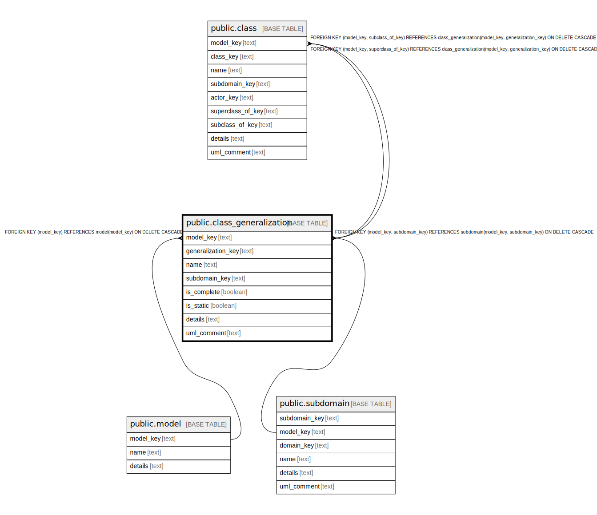

# public.class_generalization

## Description

A relationship between classes indicating super classes and subclasses.

## Columns

| Name | Type | Default | Nullable | Children | Parents | Comment |
| ---- | ---- | ------- | -------- | -------- | ------- | ------- |
| model_key | text |  | false | [public.class](public.class.md) | [public.model](public.model.md) [public.subdomain](public.subdomain.md) | The model this generalization is part of. |
| generalization_key | text |  | false | [public.class](public.class.md) |  | The internal ID. |
| name | text |  | false |  |  | The unique name of the generalization. |
| subdomain_key | text |  | false |  | [public.subdomain](public.subdomain.md) | The subdomain this class is part of. |
| is_complete | boolean |  | true |  |  | Are the specializations complete, or can an instantiation of this generalization exist without a specialization. |
| is_static | boolean |  | true |  |  | Are the specializations static and unchanging or can they change during runtime. |
| details | text |  | true |  |  | A summary description. |
| uml_comment | text |  | true |  |  | A comment that appears in the diagrams. |

## Constraints

| Name | Type | Definition |
| ---- | ---- | ---------- |
| class_generalization_generalization_key_not_null | n | NOT NULL generalization_key |
| class_generalization_model_key_not_null | n | NOT NULL model_key |
| class_generalization_name_not_null | n | NOT NULL name |
| class_generalization_subdomain_key_not_null | n | NOT NULL subdomain_key |
| fk_generalization_model | FOREIGN KEY | FOREIGN KEY (model_key) REFERENCES model(model_key) ON DELETE CASCADE |
| fk_class_subdomain | FOREIGN KEY | FOREIGN KEY (model_key, subdomain_key) REFERENCES subdomain(model_key, subdomain_key) ON DELETE CASCADE |
| class_generalization_pkey | PRIMARY KEY | PRIMARY KEY (model_key, generalization_key) |

## Indexes

| Name | Definition |
| ---- | ---------- |
| class_generalization_pkey | CREATE UNIQUE INDEX class_generalization_pkey ON public.class_generalization USING btree (model_key, generalization_key) |

## Relations

---

> Generated by [tbls](https://github.com/k1LoW/tbls)
