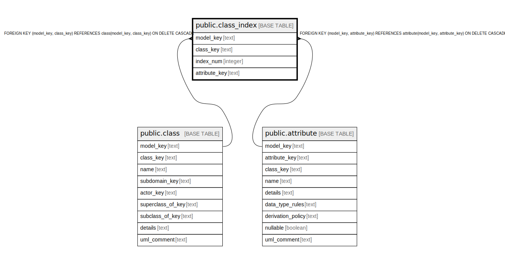

# public.class_index

## Description

A unique identity for a class, may be mulitple attributes together for the identity.

## Columns

| Name | Type | Default | Nullable | Children | Parents | Comment |
| ---- | ---- | ------- | -------- | -------- | ------- | ------- |
| model_key | text |  | false |  | [public.class](public.class.md) [public.attribute](public.attribute.md) | The model the class attribute is part of. |
| class_key | text |  | false |  | [public.class](public.class.md) | The class this index is part of. |
| index_num | integer |  | false |  |  | The specific index this attribute is part of. |
| attribute_key | text |  | false |  | [public.attribute](public.attribute.md) | The attribute that contributes to this index. An attribute can be part of more than one index. |

## Constraints

| Name | Type | Definition |
| ---- | ---- | ---------- |
| fk_index_class | FOREIGN KEY | FOREIGN KEY (model_key, class_key) REFERENCES class(model_key, class_key) ON DELETE CASCADE |
| fk_index_attribute | FOREIGN KEY | FOREIGN KEY (model_key, attribute_key) REFERENCES attribute(model_key, attribute_key) ON DELETE CASCADE |
| class_index_pkey | PRIMARY KEY | PRIMARY KEY (model_key, class_key, index_num, attribute_key) |

## Indexes

| Name | Definition |
| ---- | ---------- |
| class_index_pkey | CREATE UNIQUE INDEX class_index_pkey ON public.class_index USING btree (model_key, class_key, index_num, attribute_key) |

## Relations

---

> Generated by [tbls](https://github.com/k1LoW/tbls)
