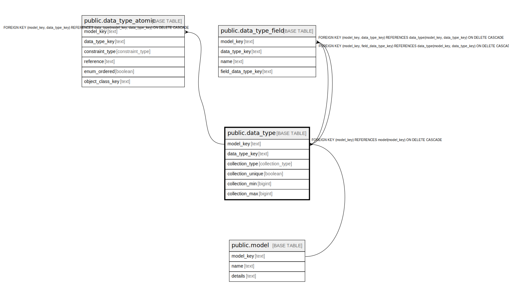

# public.data_type

## Description

An data type for use in a class attribute or action parameter.

## Columns

| Name | Type | Default | Nullable | Children | Parents | Comment |
| ---- | ---- | ------- | -------- | -------- | ------- | ------- |
| model_key | text |  | false | [public.data_type_atomic](public.data_type_atomic.md) [public.data_type_field](public.data_type_field.md) [public.attribute](public.attribute.md) [public.parameter](public.parameter.md) | [public.model](public.model.md) | The model this data type is part of. |
| data_type_key | text |  | false | [public.data_type_atomic](public.data_type_atomic.md) [public.data_type_field](public.data_type_field.md) [public.attribute](public.attribute.md) [public.parameter](public.parameter.md) |  | The internal ID. |
| collection_type | collection_type |  | false |  |  | Whether a collection or atomic value, and if a collection what kind. |
| collection_unique | boolean |  | true |  |  | If a collection, is this collection unique. |
| collection_min | bigint |  | true |  |  | If a collection and there is a minimum number of items, the minimum. Always set of maximum set. |
| collection_max | bigint |  | true |  |  | If a collection and there is a maximum number of items, the maximum. |

## Constraints

| Name | Type | Definition |
| ---- | ---- | ---------- |
| data_type_check | CHECK | CHECK ((collection_max >= collection_min)) |
| data_type_collection_min_check | CHECK | CHECK ((collection_min > 0)) |
| data_type_collection_type_not_null | n | NOT NULL collection_type |
| data_type_data_type_key_not_null | n | NOT NULL data_type_key |
| data_type_model_key_not_null | n | NOT NULL model_key |
| fk_data_type_model | FOREIGN KEY | FOREIGN KEY (model_key) REFERENCES model(model_key) ON DELETE CASCADE |
| data_type_pkey | PRIMARY KEY | PRIMARY KEY (model_key, data_type_key) |

## Indexes

| Name | Definition |
| ---- | ---------- |
| data_type_pkey | CREATE UNIQUE INDEX data_type_pkey ON public.data_type USING btree (model_key, data_type_key) |

## Relations

---

> Generated by [tbls](https://github.com/k1LoW/tbls)
