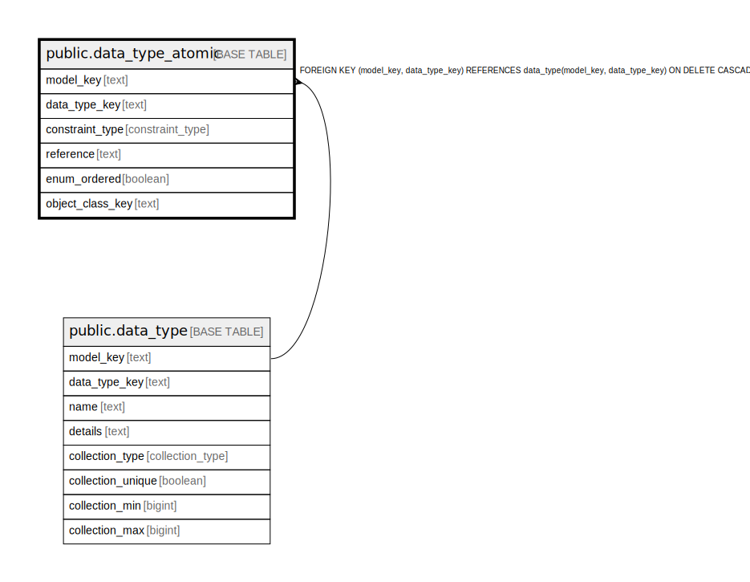

# public.data_type_atomic

## Description

An atomic type that backs a data type for eventual use in a class attribute or action parameter.

## Columns

| Name | Type | Default | Nullable | Children | Parents | Comment |
| ---- | ---- | ------- | -------- | -------- | ------- | ------- |
| model_key | text |  | false | [public.data_type_atomic_enum_value](public.data_type_atomic_enum_value.md) [public.data_type_atomic_span](public.data_type_atomic_span.md) | [public.data_type](public.data_type.md) | The model this data type is part of. |
| data_type_key | text |  | false | [public.data_type_atomic_enum_value](public.data_type_atomic_enum_value.md) [public.data_type_atomic_span](public.data_type_atomic_span.md) | [public.data_type](public.data_type.md) | The internal ID from data_type. |
| constraint_type | constraint_type | 'unconstrained'::constraint_type | false |  |  | The constraints on values for this data type. |
| reference | text |  | true |  |  | If this is a reference, the details that define it. |
| enum_ordered | boolean |  | true |  |  | If this is an enumeration, enumerations could be ordered, so they can be compared greater-lesser-than against each other. |
| object_class_key | text |  | true |  |  | If this is an object, which class it is. |

## Constraints

| Name | Type | Definition |
| ---- | ---- | ---------- |
| data_type_atomic_constraint_type_not_null | n | NOT NULL constraint_type |
| data_type_atomic_data_type_key_not_null | n | NOT NULL data_type_key |
| data_type_atomic_model_key_not_null | n | NOT NULL model_key |
| fk_atomic_data_type | FOREIGN KEY | FOREIGN KEY (model_key, data_type_key) REFERENCES data_type(model_key, data_type_key) ON DELETE CASCADE |
| data_type_atomic_pkey | PRIMARY KEY | PRIMARY KEY (model_key, data_type_key) |

## Indexes

| Name | Definition |
| ---- | ---------- |
| data_type_atomic_pkey | CREATE UNIQUE INDEX data_type_atomic_pkey ON public.data_type_atomic USING btree (model_key, data_type_key) |

## Relations

---

> Generated by [tbls](https://github.com/k1LoW/tbls)
