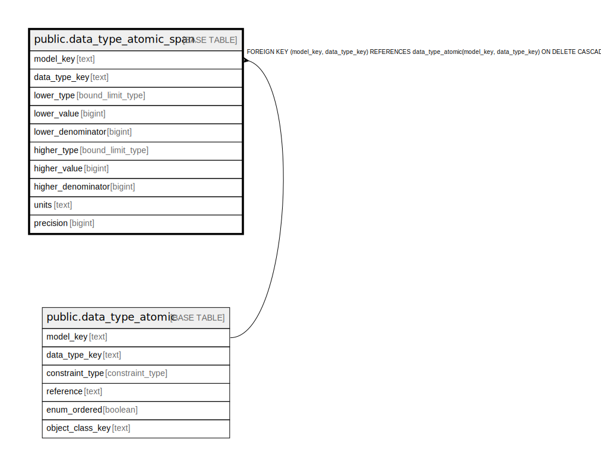

# public.data_type_atomic_span

## Description

The definition of a span for an atomic data type.

## Columns

| Name | Type | Default | Nullable | Children | Parents | Comment |
| ---- | ---- | ------- | -------- | -------- | ------- | ------- |
| model_key | text |  | false |  | [public.data_type_atomic](public.data_type_atomic.md) | The model this data type is part of. |
| data_type_key | text |  | false |  | [public.data_type_atomic](public.data_type_atomic.md) | The internal ID from data_type_atomic. |
| lower_type | bound_limit_type |  | false |  |  | Whether the lower end of the span is unconstrained, open, or closed. |
| lower_value | bigint |  | true |  |  | The value that defines the lower end of the span. |
| lower_denominator | bigint |  | true |  |  | If the lower bound is a ratio. |
| higher_type | bound_limit_type |  | false |  |  | Whether the higher end of the span is unconstrained, open, or closed. |
| higher_value | bigint |  | true |  |  | The value that defines the higher end of the span. |
| higher_denominator | bigint |  | true |  |  | If the higher bound is a ratio. |
| units | text |  | false |  |  | The units of this span. |
| precision | numeric |  | false |  |  | The precision of this span. Values in the form of 1.0, 0.1, 0.01, 0.001, etc. |

## Constraints

| Name | Type | Definition |
| ---- | ---- | ---------- |
| data_type_atomic_span_precision_check | CHECK | CHECK ((("precision" <= (1)::numeric) AND ("precision" > (0)::numeric) AND (floor(log10("precision")) = log10("precision")))) |
| fk_span_atomic | FOREIGN KEY | FOREIGN KEY (model_key, data_type_key) REFERENCES data_type_atomic(model_key, data_type_key) ON DELETE CASCADE |
| data_type_atomic_span_pkey | PRIMARY KEY | PRIMARY KEY (model_key, data_type_key) |

## Indexes

| Name | Definition |
| ---- | ---------- |
| data_type_atomic_span_pkey | CREATE UNIQUE INDEX data_type_atomic_span_pkey ON public.data_type_atomic_span USING btree (model_key, data_type_key) |

## Relations

---

> Generated by [tbls](https://github.com/k1LoW/tbls)
