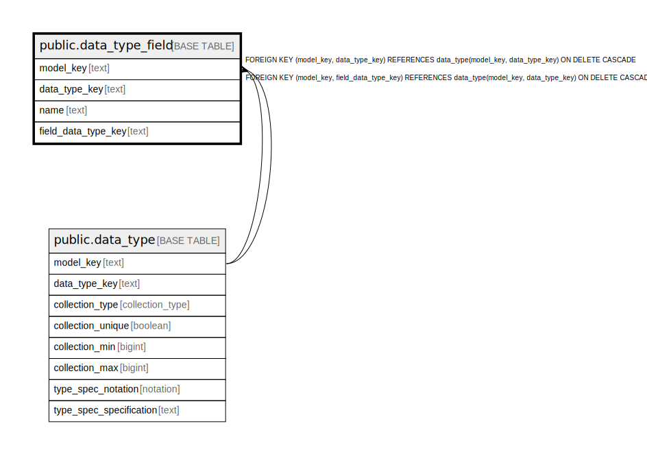

# public.data_type_field

## Description

A field of a record data type.

## Columns

| Name | Type | Default | Nullable | Children | Parents | Comment |
| ---- | ---- | ------- | -------- | -------- | ------- | ------- |
| model_key | text |  | false |  | [public.data_type](public.data_type.md) | The model this data type is part of. |
| data_type_key | text |  | false |  | [public.data_type](public.data_type.md) | The internal ID from data_type. |
| name | text |  | false |  |  | The unique name of the field within the data type. |
| field_data_type_key | text |  | false |  | [public.data_type](public.data_type.md) | The data type of this field value. |

## Constraints

| Name | Type | Definition |
| ---- | ---- | ---------- |
| fk_field_data_type | FOREIGN KEY | FOREIGN KEY (model_key, data_type_key) REFERENCES data_type(model_key, data_type_key) ON DELETE CASCADE |
| fk_field_field_data_type | FOREIGN KEY | FOREIGN KEY (model_key, field_data_type_key) REFERENCES data_type(model_key, data_type_key) ON DELETE CASCADE |
| data_type_field_pkey | PRIMARY KEY | PRIMARY KEY (model_key, data_type_key, name) |

## Indexes

| Name | Definition |
| ---- | ---------- |
| data_type_field_pkey | CREATE UNIQUE INDEX data_type_field_pkey ON public.data_type_field USING btree (model_key, data_type_key, name) |

## Relations

---

> Generated by [tbls](https://github.com/k1LoW/tbls)
