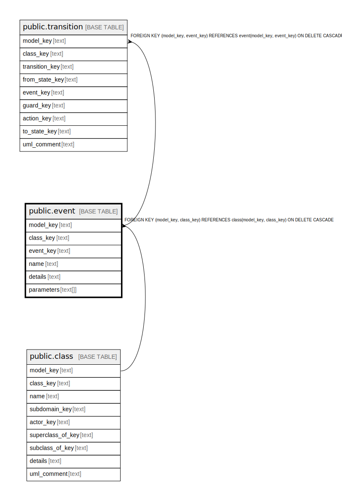

# public.event

## Description

Some occurence that can potentially trigger a change in and instance.

## Columns

| Name | Type | Default | Nullable | Children | Parents | Comment |
| ---- | ---- | ------- | -------- | -------- | ------- | ------- |
| model_key | text |  | false | [public.event_parameter](public.event_parameter.md) [public.transition](public.transition.md) | [public.class](public.class.md) | The model this state machine is part of. |
| class_key | text |  | false |  | [public.class](public.class.md) | The class this event is in. |
| event_key | text |  | false | [public.event_parameter](public.event_parameter.md) [public.transition](public.transition.md) |  | The internal ID. |
| name | text |  | false |  |  | The unique name of the event in the class. |
| details | text |  | true |  |  | A summary description. |

## Constraints

| Name | Type | Definition |
| ---- | ---- | ---------- |
| event_class_key_not_null | n | NOT NULL class_key |
| event_event_key_not_null | n | NOT NULL event_key |
| event_model_key_not_null | n | NOT NULL model_key |
| event_name_not_null | n | NOT NULL name |
| fk_event_class | FOREIGN KEY | FOREIGN KEY (model_key, class_key) REFERENCES class(model_key, class_key) ON DELETE CASCADE |
| event_pkey | PRIMARY KEY | PRIMARY KEY (model_key, event_key) |

## Indexes

| Name | Definition |
| ---- | ---------- |
| event_pkey | CREATE UNIQUE INDEX event_pkey ON public.event USING btree (model_key, event_key) |

## Relations

---

> Generated by [tbls](https://github.com/k1LoW/tbls)
