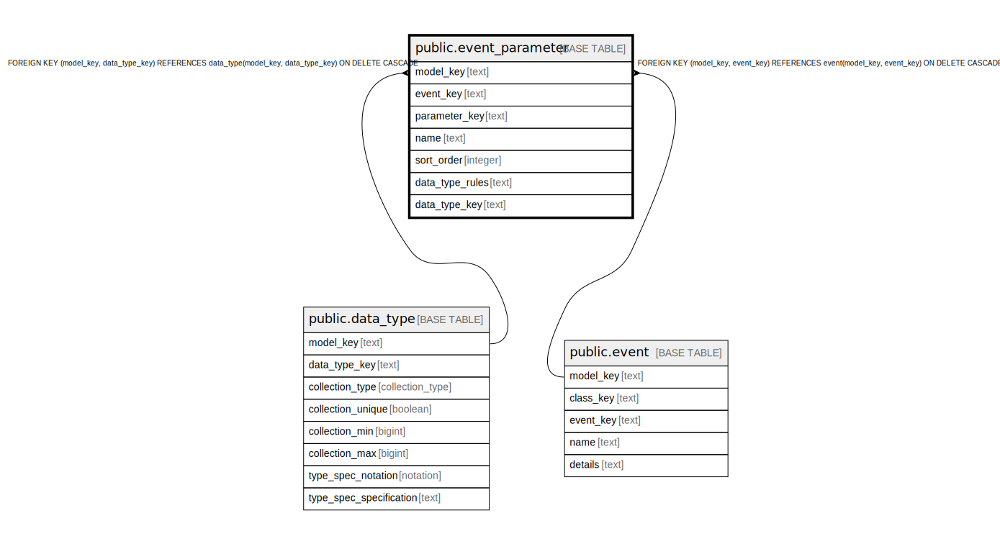

# public.event_parameter

## Description

A parameter of an event.

## Columns

| Name | Type | Default | Nullable | Children | Parents | Comment |
| ---- | ---- | ------- | -------- | -------- | ------- | ------- |
| model_key | text |  | false |  | [public.data_type](public.data_type.md) [public.event](public.event.md) | The model this event is part of. |
| event_key | text |  | false |  | [public.event](public.event.md) | The event this parameter is part of. |
| parameter_key | text |  | false |  |  | The internal ID, the name but lower case. |
| name | text |  | false |  |  | The unique name of the parameter within the event. |
| sort_order | integer |  | false |  |  | Parameters are an ordered list. |
| data_type_rules | text |  | true |  |  | The rules for a well-formed value. |
| data_type_key | text |  | true |  | [public.data_type](public.data_type.md) | If the rules are parsable, the data type they parse into. |

## Constraints

| Name | Type | Definition |
| ---- | ---- | ---------- |
| event_parameter_event_key_not_null | n | NOT NULL event_key |
| event_parameter_model_key_not_null | n | NOT NULL model_key |
| event_parameter_name_not_null | n | NOT NULL name |
| event_parameter_parameter_key_not_null | n | NOT NULL parameter_key |
| event_parameter_sort_order_not_null | n | NOT NULL sort_order |
| fk_event_parameter_data_type | FOREIGN KEY | FOREIGN KEY (model_key, data_type_key) REFERENCES data_type(model_key, data_type_key) ON DELETE CASCADE |
| fk_event_parameter_event | FOREIGN KEY | FOREIGN KEY (model_key, event_key) REFERENCES event(model_key, event_key) ON DELETE CASCADE |
| event_parameter_pkey | PRIMARY KEY | PRIMARY KEY (model_key, event_key, parameter_key) |

## Indexes

| Name | Definition |
| ---- | ---------- |
| event_parameter_pkey | CREATE UNIQUE INDEX event_parameter_pkey ON public.event_parameter USING btree (model_key, event_key, parameter_key) |

## Relations

---

> Generated by [tbls](https://github.com/k1LoW/tbls)
