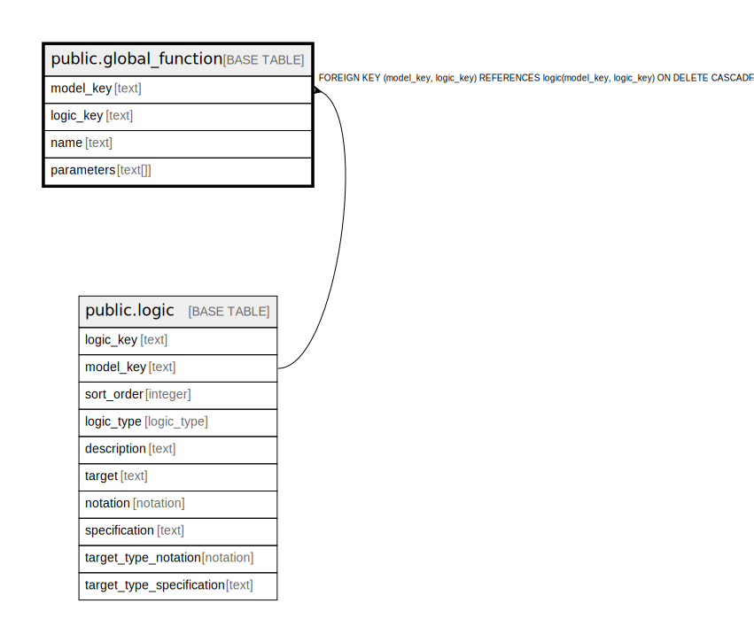

# public.global_function

## Description

A global function used to describe simulation and code generation.

## Columns

| Name | Type | Default | Nullable | Children | Parents | Comment |
| ---- | ---- | ------- | -------- | -------- | ------- | ------- |
| model_key | text |  | false |  | [public.logic](public.logic.md) | The model this function is part of. |
| logic_key | text |  | false |  | [public.logic](public.logic.md) | The logic of the function. |
| name | text |  | false |  |  | The name of the function, fitting for the notation of the logic. |
| comment | text | ''::text | false |  |  | A descriptive comment about the function. |
| parameters | text[] |  | true |  |  | The parameters of the function, fitting for the notation of the logic. |

## Constraints

| Name | Type | Definition |
| ---- | ---- | ---------- |
| global_function_comment_not_null | n | NOT NULL comment |
| global_function_logic_key_not_null | n | NOT NULL logic_key |
| global_function_model_key_not_null | n | NOT NULL model_key |
| global_function_name_not_null | n | NOT NULL name |
| fk_global_logic | FOREIGN KEY | FOREIGN KEY (model_key, logic_key) REFERENCES logic(model_key, logic_key) ON DELETE CASCADE |
| global_function_pkey | PRIMARY KEY | PRIMARY KEY (model_key, logic_key) |
| global_function_model_key_name_key | UNIQUE | UNIQUE (model_key, name) |

## Indexes

| Name | Definition |
| ---- | ---------- |
| global_function_pkey | CREATE UNIQUE INDEX global_function_pkey ON public.global_function USING btree (model_key, logic_key) |
| global_function_model_key_name_key | CREATE UNIQUE INDEX global_function_model_key_name_key ON public.global_function USING btree (model_key, name) |

## Relations

---

> Generated by [tbls](https://github.com/k1LoW/tbls)
