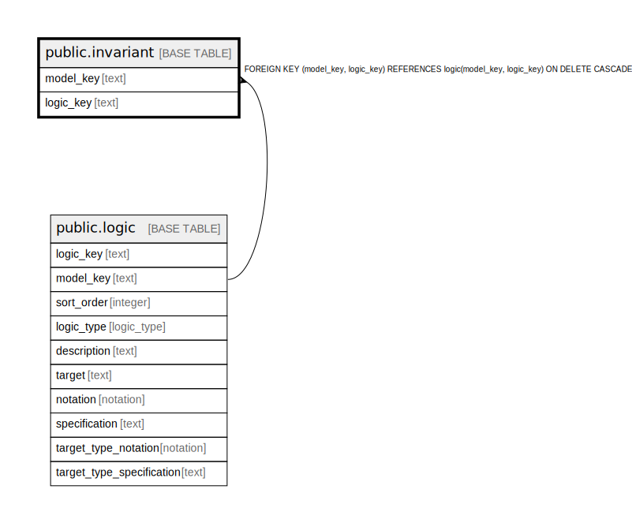

# public.invariant

## Description

An invariant that is forever true in the model.

## Columns

| Name | Type | Default | Nullable | Children | Parents | Comment |
| ---- | ---- | ------- | -------- | -------- | ------- | ------- |
| model_key | text |  | false |  | [public.logic](public.logic.md) | The model this invariant is part of. |
| logic_key | text |  | false |  | [public.logic](public.logic.md) | The logic of the invariant. |

## Constraints

| Name | Type | Definition |
| ---- | ---- | ---------- |
| invariant_logic_key_not_null | n | NOT NULL logic_key |
| invariant_model_key_not_null | n | NOT NULL model_key |
| fk_invariant_logic | FOREIGN KEY | FOREIGN KEY (model_key, logic_key) REFERENCES logic(model_key, logic_key) ON DELETE CASCADE |
| invariant_pkey | PRIMARY KEY | PRIMARY KEY (model_key, logic_key) |

## Indexes

| Name | Definition |
| ---- | ---------- |
| invariant_pkey | CREATE UNIQUE INDEX invariant_pkey ON public.invariant USING btree (model_key, logic_key) |

## Relations

---

> Generated by [tbls](https://github.com/k1LoW/tbls)
