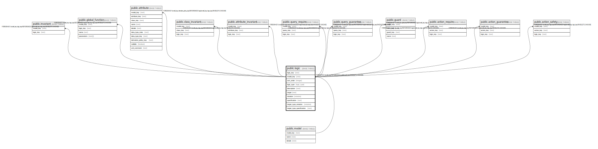

# public.logic

## Description

A bit of business logic.

## Columns

| Name | Type | Default | Nullable | Children | Parents | Comment |
| ---- | ---- | ------- | -------- | -------- | ------- | ------- |
| logic_key | text |  | false | [public.invariant](public.invariant.md) [public.global_function](public.global_function.md) [public.attribute](public.attribute.md) [public.query_require](public.query_require.md) [public.query_guarantee](public.query_guarantee.md) [public.guard](public.guard.md) [public.action_require](public.action_require.md) [public.action_guarantee](public.action_guarantee.md) [public.action_safety](public.action_safety.md) |  | The internal ID. |
| model_key | text |  | false | [public.invariant](public.invariant.md) [public.global_function](public.global_function.md) [public.attribute](public.attribute.md) [public.query_require](public.query_require.md) [public.query_guarantee](public.query_guarantee.md) [public.guard](public.guard.md) [public.action_require](public.action_require.md) [public.action_guarantee](public.action_guarantee.md) [public.action_safety](public.action_safety.md) | [public.model](public.model.md) | The model this logic is part of. |
| sort_order | integer |  | false |  |  | Often part of a list of logics that are sorted. |
| description | text |  | false |  |  | The casual readable form of the logic. |
| notation | notation |  | false |  |  | The type of notation used for the specification. |
| specification | text |  | true |  |  | The unambiguous form of the logic. |

## Constraints

| Name | Type | Definition |
| ---- | ---- | ---------- |
| logic_description_not_null | n | NOT NULL description |
| logic_logic_key_not_null | n | NOT NULL logic_key |
| logic_model_key_not_null | n | NOT NULL model_key |
| logic_notation_not_null | n | NOT NULL notation |
| logic_sort_order_not_null | n | NOT NULL sort_order |
| fk_logic_model | FOREIGN KEY | FOREIGN KEY (model_key) REFERENCES model(model_key) ON DELETE CASCADE |
| logic_pkey | PRIMARY KEY | PRIMARY KEY (model_key, logic_key) |

## Indexes

| Name | Definition |
| ---- | ---------- |
| logic_pkey | CREATE UNIQUE INDEX logic_pkey ON public.logic USING btree (model_key, logic_key) |

## Relations

---

> Generated by [tbls](https://github.com/k1LoW/tbls)
