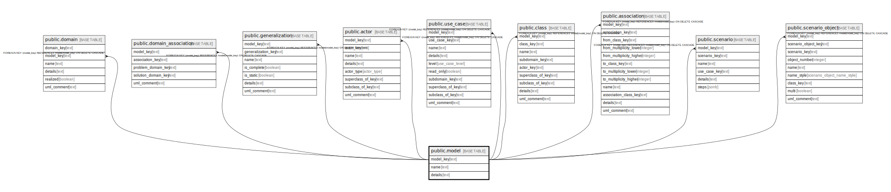

# public.model

## Description

A fully distinct semantic model, separate from all others.

## Columns

| Name | Type | Default | Nullable | Children | Parents | Comment |
| ---- | ---- | ------- | -------- | -------- | ------- | ------- |
| model_key | text |  | false | [public.domain](public.domain.md) [public.domain_association](public.domain_association.md) [public.generalization](public.generalization.md) [public.actor](public.actor.md) [public.use_case](public.use_case.md) [public.data_type](public.data_type.md) [public.class](public.class.md) [public.association](public.association.md) [public.scenario](public.scenario.md) [public.scenario_object](public.scenario_object.md) |  | The internal ID. |
| name | text |  | false |  |  | The unique name of the domain. |
| details | text |  | true |  |  | A summary description. |

## Constraints

| Name | Type | Definition |
| ---- | ---- | ---------- |
| model_pkey | PRIMARY KEY | PRIMARY KEY (model_key) |

## Indexes

| Name | Definition |
| ---- | ---------- |
| model_pkey | CREATE UNIQUE INDEX model_pkey ON public.model USING btree (model_key) |

## Relations

---

> Generated by [tbls](https://github.com/k1LoW/tbls)
