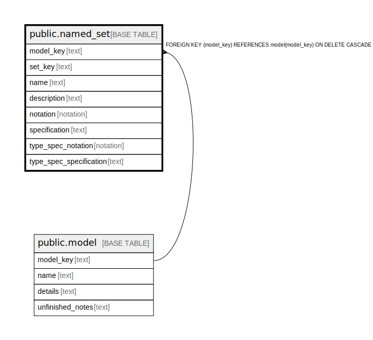

# public.named_set

## Description

A reusable named set definition at the model level, referenced from behavioral logic via named_set_ref expressions.

## Columns

| Name | Type | Default | Nullable | Children | Parents | Comment |
| ---- | ---- | ------- | -------- | -------- | ------- | ------- |
| model_key | text |  | false |  | [public.model](public.model.md) | The model this named set is part of. |
| set_key | text |  | false |  |  | The internal ID of the named set. |
| name | text |  | false |  |  | The unique name of the named set within the model. |
| description | text |  | false |  |  | Optional description of the named set. |
| notation | notation |  | false |  |  | The notation used for the set specification (e.g., tla_plus). |
| specification | text |  | false |  |  | The formal specification of the set contents. |
| type_spec_notation | notation |  | true |  |  | Optional notation for a precise type specification. |
| type_spec_specification | text |  | true |  |  | Optional precise type specification string. |

## Constraints

| Name | Type | Definition |
| ---- | ---- | ---------- |
| named_set_description_not_null | n | NOT NULL description |
| named_set_model_key_not_null | n | NOT NULL model_key |
| named_set_name_not_null | n | NOT NULL name |
| named_set_notation_not_null | n | NOT NULL notation |
| named_set_set_key_not_null | n | NOT NULL set_key |
| named_set_specification_not_null | n | NOT NULL specification |
| fk_named_set_model | FOREIGN KEY | FOREIGN KEY (model_key) REFERENCES model(model_key) ON DELETE CASCADE |
| named_set_pkey | PRIMARY KEY | PRIMARY KEY (model_key, set_key) |
| named_set_model_key_name_key | UNIQUE | UNIQUE (model_key, name) |

## Indexes

| Name | Definition |
| ---- | ---------- |
| named_set_pkey | CREATE UNIQUE INDEX named_set_pkey ON public.named_set USING btree (model_key, set_key) |
| named_set_model_key_name_key | CREATE UNIQUE INDEX named_set_model_key_name_key ON public.named_set USING btree (model_key, name) |

## Relations

---

> Generated by [tbls](https://github.com/k1LoW/tbls)
