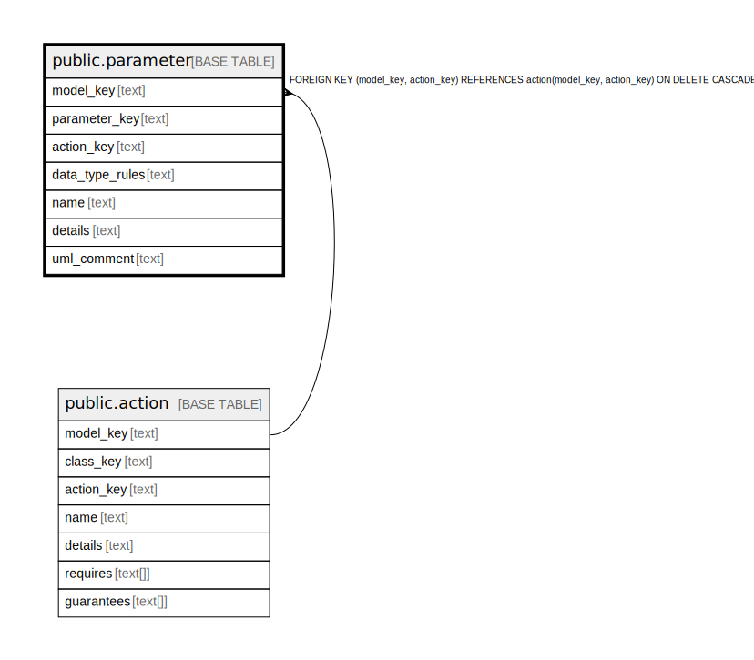

# public.parameter

## Description

A parameter of an action.

## Columns

| Name | Type | Default | Nullable | Children | Parents | Comment |
| ---- | ---- | ------- | -------- | -------- | ------- | ------- |
| model_key | text |  | false |  | [public.data_type](public.data_type.md) [public.action](public.action.md) | The model this state machine is part of. |
| parameter_key | text |  | false |  |  | The internal ID. |
| action_key | text |  | false |  | [public.action](public.action.md) | The action this parameter is part of. |
| data_type_rules | text |  | true |  |  | The rules for a well-formed value. |
| data_type_key | text |  | true |  | [public.data_type](public.data_type.md) | If the rules are parsable, the data type they parse into. |
| name | text |  | false |  |  | The unique name of the parameter within the attribute. |
| details | text |  | true |  |  | A summary description. |
| uml_comment | text |  | true |  |  | A comment that appears in the diagrams. |

## Constraints

| Name | Type | Definition |
| ---- | ---- | ---------- |
| fk_parameter_data_type | FOREIGN KEY | FOREIGN KEY (model_key, data_type_key) REFERENCES data_type(model_key, data_type_key) ON DELETE CASCADE |
| fk_parameter_action | FOREIGN KEY | FOREIGN KEY (model_key, action_key) REFERENCES action(model_key, action_key) ON DELETE CASCADE |
| parameter_pkey | PRIMARY KEY | PRIMARY KEY (model_key, parameter_key) |

## Indexes

| Name | Definition |
| ---- | ---------- |
| parameter_pkey | CREATE UNIQUE INDEX parameter_pkey ON public.parameter USING btree (model_key, parameter_key) |

## Relations

---

> Generated by [tbls](https://github.com/k1LoW/tbls)
