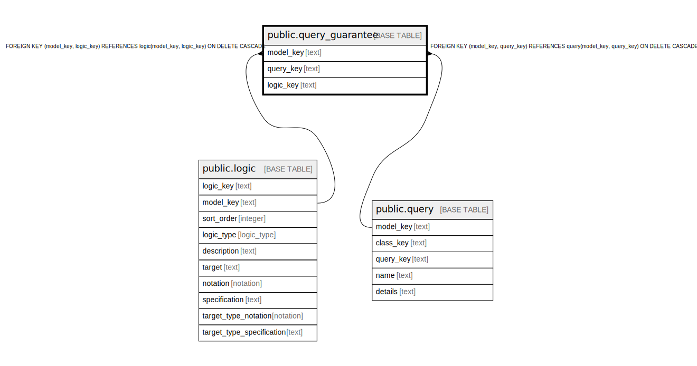

# public.query_guarantee

## Description

A guarantee of what is returned by this query.

## Columns

| Name | Type | Default | Nullable | Children | Parents | Comment |
| ---- | ---- | ------- | -------- | -------- | ------- | ------- |
| model_key | text |  | false |  | [public.logic](public.logic.md) [public.query](public.query.md) | The model this guarantee is part of. |
| query_key | text |  | false |  | [public.query](public.query.md) | The query this guarantee is part of. |
| logic_key | text |  | false |  | [public.logic](public.logic.md) | The logic of the guarantee. |

## Constraints

| Name | Type | Definition |
| ---- | ---- | ---------- |
| query_guarantee_logic_key_not_null | n | NOT NULL logic_key |
| query_guarantee_model_key_not_null | n | NOT NULL model_key |
| query_guarantee_query_key_not_null | n | NOT NULL query_key |
| fk_query_guarantee_logic | FOREIGN KEY | FOREIGN KEY (model_key, logic_key) REFERENCES logic(model_key, logic_key) ON DELETE CASCADE |
| fk_query_guarantee_query | FOREIGN KEY | FOREIGN KEY (model_key, query_key) REFERENCES query(model_key, query_key) ON DELETE CASCADE |
| query_guarantee_pkey | PRIMARY KEY | PRIMARY KEY (model_key, query_key, logic_key) |

## Indexes

| Name | Definition |
| ---- | ---------- |
| query_guarantee_pkey | CREATE UNIQUE INDEX query_guarantee_pkey ON public.query_guarantee USING btree (model_key, query_key, logic_key) |

## Relations

---

> Generated by [tbls](https://github.com/k1LoW/tbls)
