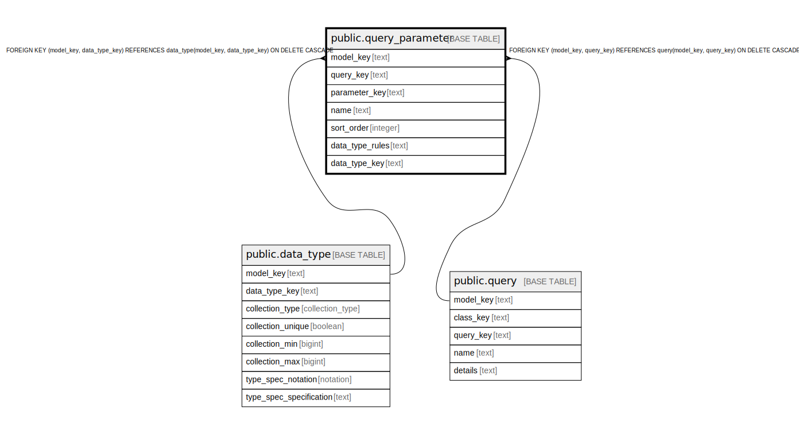

# public.query_parameter

## Description

A parameter of a query.

## Columns

| Name | Type | Default | Nullable | Children | Parents | Comment |
| ---- | ---- | ------- | -------- | -------- | ------- | ------- |
| model_key | text |  | false |  | [public.data_type](public.data_type.md) [public.query](public.query.md) | The model this query is part of. |
| query_key | text |  | false |  | [public.query](public.query.md) | The query this parameter is part of. |
| parameter_key | text |  | false |  |  | The internal ID, the name but lower case. |
| name | text |  | false |  |  | The unique name of the parameter within the query. |
| sort_order | integer |  | false |  |  | Parameters are an ordered list. |
| data_type_rules | text |  | true |  |  | The rules for a well-formed value. |
| data_type_key | text |  | true |  | [public.data_type](public.data_type.md) | If the rules are parsable, the data type they parse into. |

## Constraints

| Name | Type | Definition |
| ---- | ---- | ---------- |
| query_parameter_model_key_not_null | n | NOT NULL model_key |
| query_parameter_name_not_null | n | NOT NULL name |
| query_parameter_parameter_key_not_null | n | NOT NULL parameter_key |
| query_parameter_query_key_not_null | n | NOT NULL query_key |
| query_parameter_sort_order_not_null | n | NOT NULL sort_order |
| fk_parameter_data_type | FOREIGN KEY | FOREIGN KEY (model_key, data_type_key) REFERENCES data_type(model_key, data_type_key) ON DELETE CASCADE |
| fk_parameter_query | FOREIGN KEY | FOREIGN KEY (model_key, query_key) REFERENCES query(model_key, query_key) ON DELETE CASCADE |
| query_parameter_pkey | PRIMARY KEY | PRIMARY KEY (model_key, query_key, parameter_key) |

## Indexes

| Name | Definition |
| ---- | ---------- |
| query_parameter_pkey | CREATE UNIQUE INDEX query_parameter_pkey ON public.query_parameter USING btree (model_key, query_key, parameter_key) |

## Relations

---

> Generated by [tbls](https://github.com/k1LoW/tbls)
