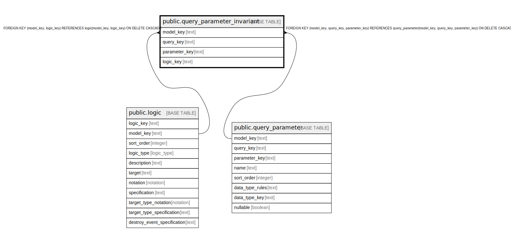

# public.query_parameter_invariant

## Description

Join table linking query parameters to their invariant logic predicates.

## Columns

| Name | Type | Default | Nullable | Children | Parents | Comment |
| ---- | ---- | ------- | -------- | -------- | ------- | ------- |
| model_key | text |  | false |  | [public.logic](public.logic.md) [public.query_parameter](public.query_parameter.md) | The model this query parameter invariant belongs to. |
| query_key | text |  | false |  | [public.query_parameter](public.query_parameter.md) | The query this parameter invariant is part of. |
| parameter_key | text |  | false |  | [public.query_parameter](public.query_parameter.md) | The parameter this invariant constrains. |
| logic_key | text |  | false |  | [public.logic](public.logic.md) | The logic predicate that must hold for the parameter value. |

## Constraints

| Name | Type | Definition |
| ---- | ---- | ---------- |
| query_parameter_invariant_logic_key_not_null | n | NOT NULL logic_key |
| query_parameter_invariant_model_key_not_null | n | NOT NULL model_key |
| query_parameter_invariant_parameter_key_not_null | n | NOT NULL parameter_key |
| query_parameter_invariant_query_key_not_null | n | NOT NULL query_key |
| fk_query_param_invariant_logic | FOREIGN KEY | FOREIGN KEY (model_key, logic_key) REFERENCES logic(model_key, logic_key) ON DELETE CASCADE |
| fk_query_param_invariant_parameter | FOREIGN KEY | FOREIGN KEY (model_key, query_key, parameter_key) REFERENCES query_parameter(model_key, query_key, parameter_key) ON DELETE CASCADE |
| query_parameter_invariant_pkey | PRIMARY KEY | PRIMARY KEY (model_key, query_key, parameter_key, logic_key) |

## Indexes

| Name | Definition |
| ---- | ---------- |
| query_parameter_invariant_pkey | CREATE UNIQUE INDEX query_parameter_invariant_pkey ON public.query_parameter_invariant USING btree (model_key, query_key, parameter_key, logic_key) |

## Relations

---

> Generated by [tbls](https://github.com/k1LoW/tbls)
