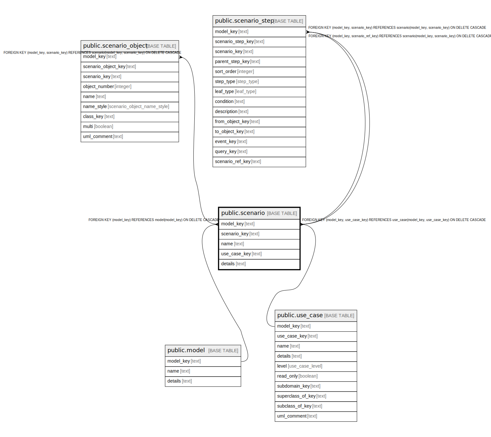

# public.scenario

## Description

A documented scenario, such as a sequence diagram or activity diagram, for a use case.

## Columns

| Name | Type | Default | Nullable | Children | Parents | Comment |
| ---- | ---- | ------- | -------- | -------- | ------- | ------- |
| model_key | text |  | false | [public.scenario_object](public.scenario_object.md) | [public.model](public.model.md) [public.use_case](public.use_case.md) | The model this scenario is part of. |
| scenario_key | text |  | false | [public.scenario_object](public.scenario_object.md) |  | The internal ID. |
| name | text |  | false |  |  | The name of the scenario. |
| use_case_key | text |  | false |  | [public.use_case](public.use_case.md) | The use case this scenario is part of. |
| details | text |  | true |  |  | A summary description. |
| steps | jsonb |  | true |  |  | The structured program steps of the scenario as JSON. |

## Constraints

| Name | Type | Definition |
| ---- | ---- | ---------- |
| scenario_model_key_not_null | n | NOT NULL model_key |
| scenario_name_not_null | n | NOT NULL name |
| scenario_scenario_key_not_null | n | NOT NULL scenario_key |
| scenario_use_case_key_not_null | n | NOT NULL use_case_key |
| fk_scenario_model | FOREIGN KEY | FOREIGN KEY (model_key) REFERENCES model(model_key) ON DELETE CASCADE |
| fk_scenario_use_case | FOREIGN KEY | FOREIGN KEY (model_key, use_case_key) REFERENCES use_case(model_key, use_case_key) ON DELETE CASCADE |
| scenario_pkey | PRIMARY KEY | PRIMARY KEY (model_key, scenario_key) |

## Indexes

| Name | Definition |
| ---- | ---------- |
| scenario_pkey | CREATE UNIQUE INDEX scenario_pkey ON public.scenario USING btree (model_key, scenario_key) |

## Relations

---

> Generated by [tbls](https://github.com/k1LoW/tbls)
