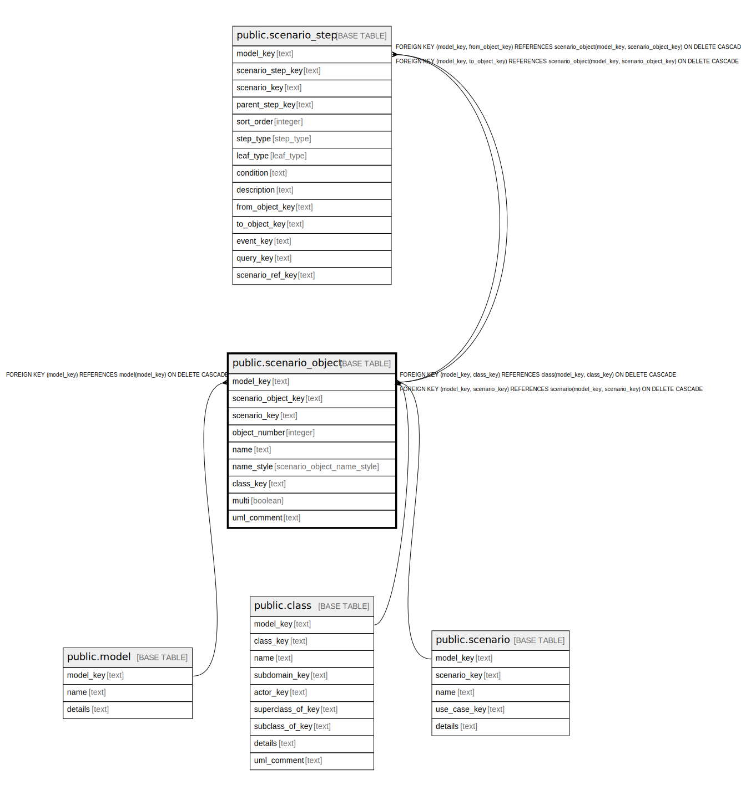

# public.scenario_object

## Description

An object that participates in a scenario.

## Columns

| Name | Type | Default | Nullable | Children | Parents | Comment |
| ---- | ---- | ------- | -------- | -------- | ------- | ------- |
| model_key | text |  | false | [public.scenario_step](public.scenario_step.md) | [public.model](public.model.md) [public.class](public.class.md) [public.scenario](public.scenario.md) | The model this scenario object is part of. |
| scenario_object_key | text |  | false | [public.scenario_step](public.scenario_step.md) |  | The internal ID. |
| scenario_key | text |  | false |  | [public.scenario](public.scenario.md) | The scenario this object is part of. |
| object_number | integer |  | false |  |  | Where this object is drawn in the diagram. |
| name | text |  | false |  |  | The name of the scenario object. |
| name_style | scenario_object_name_style |  | false |  |  | How the name is displayed in the diagram. |
| class_key | text |  | false |  | [public.class](public.class.md) | The class this scenario object is an instance of. |
| multi | boolean |  | false |  |  | If true, this object represents many instances of the class (a collection). |
| uml_comment | text |  | true |  |  | A comment that appears in the diagrams. |

## Constraints

| Name | Type | Definition |
| ---- | ---- | ---------- |
| scenario_object_class_key_not_null | n | NOT NULL class_key |
| scenario_object_model_key_not_null | n | NOT NULL model_key |
| scenario_object_multi_not_null | n | NOT NULL multi |
| scenario_object_name_not_null | n | NOT NULL name |
| scenario_object_name_style_not_null | n | NOT NULL name_style |
| scenario_object_object_number_not_null | n | NOT NULL object_number |
| scenario_object_scenario_key_not_null | n | NOT NULL scenario_key |
| scenario_object_scenario_object_key_not_null | n | NOT NULL scenario_object_key |
| fk_scenario_object_model | FOREIGN KEY | FOREIGN KEY (model_key) REFERENCES model(model_key) ON DELETE CASCADE |
| fk_scenario_object_class | FOREIGN KEY | FOREIGN KEY (model_key, class_key) REFERENCES class(model_key, class_key) ON DELETE CASCADE |
| fk_scenario_object_scenario | FOREIGN KEY | FOREIGN KEY (model_key, scenario_key) REFERENCES scenario(model_key, scenario_key) ON DELETE CASCADE |
| scenario_object_pkey | PRIMARY KEY | PRIMARY KEY (model_key, scenario_object_key) |
| scenario_object_model_key_scenario_key_object_number_key | UNIQUE | UNIQUE (model_key, scenario_key, object_number) |

## Indexes

| Name | Definition |
| ---- | ---------- |
| scenario_object_pkey | CREATE UNIQUE INDEX scenario_object_pkey ON public.scenario_object USING btree (model_key, scenario_object_key) |
| scenario_object_model_key_scenario_key_object_number_key | CREATE UNIQUE INDEX scenario_object_model_key_scenario_key_object_number_key ON public.scenario_object USING btree (model_key, scenario_key, object_number) |

## Relations

---

> Generated by [tbls](https://github.com/k1LoW/tbls)
