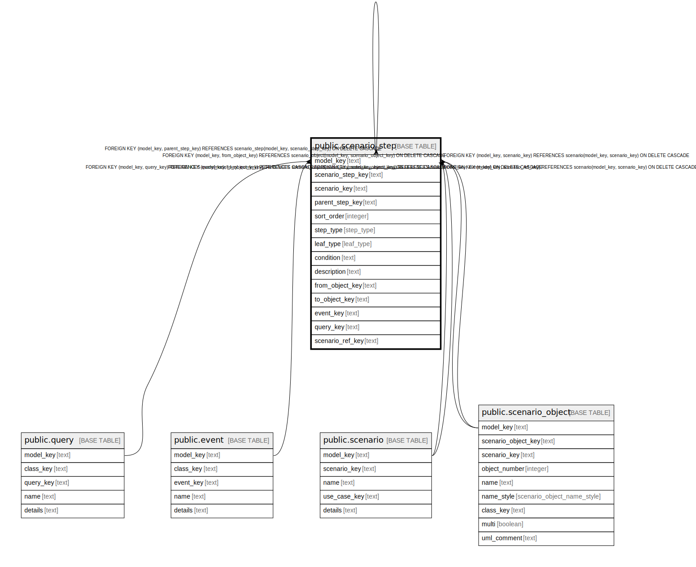

# public.scenario_step

## Description

A step of a scenario, all the steps in a scenario form a tree.

## Columns

| Name | Type | Default | Nullable | Children | Parents | Comment |
| ---- | ---- | ------- | -------- | -------- | ------- | ------- |
| model_key | text |  | false | [public.scenario_step](public.scenario_step.md) | [public.query](public.query.md) [public.event](public.event.md) [public.scenario](public.scenario.md) [public.scenario_object](public.scenario_object.md) [public.scenario_step](public.scenario_step.md) | The model this scenario step is part of. |
| scenario_step_key | text |  | false | [public.scenario_step](public.scenario_step.md) |  | The internal ID. |
| scenario_key | text |  | false |  | [public.scenario](public.scenario.md) | The scenario this object is part of. |
| parent_step_key | text |  | true |  | [public.scenario_step](public.scenario_step.md) | The parent of this step, null if the single root step. |
| sort_order | integer |  | false |  |  | The order of this step in the parent. |
| step_type | step_type |  | false |  |  | The kind of step this is. |
| leaf_type | leaf_type |  | true |  |  | If a leaf step, the kind of leaf this is. |
| condition | text |  | true |  |  | The condition for a loop or case step. |
| description | text |  | true |  |  | The description of a leaf node. |
| from_object_key | text |  | true |  | [public.scenario_object](public.scenario_object.md) | The source of a step. |
| to_object_key | text |  | true |  | [public.scenario_object](public.scenario_object.md) | The destination of a step. |
| event_key | text |  | true |  | [public.event](public.event.md) | A leaf step that changes state. |
| query_key | text |  | true |  | [public.query](public.query.md) | A leaf step that does not change state. |
| scenario_ref_key | text |  | true |  | [public.scenario](public.scenario.md) | A leaf step that is another scenario. |

## Constraints

| Name | Type | Definition |
| ---- | ---- | ---------- |
| scenario_step_model_key_not_null | n | NOT NULL model_key |
| scenario_step_scenario_key_not_null | n | NOT NULL scenario_key |
| scenario_step_scenario_step_key_not_null | n | NOT NULL scenario_step_key |
| scenario_step_sort_order_not_null | n | NOT NULL sort_order |
| scenario_step_step_type_not_null | n | NOT NULL step_type |
| fk_step_query | FOREIGN KEY | FOREIGN KEY (model_key, query_key) REFERENCES query(model_key, query_key) ON DELETE CASCADE |
| fk_step_event | FOREIGN KEY | FOREIGN KEY (model_key, event_key) REFERENCES event(model_key, event_key) ON DELETE CASCADE |
| fk_step_scenario | FOREIGN KEY | FOREIGN KEY (model_key, scenario_key) REFERENCES scenario(model_key, scenario_key) ON DELETE CASCADE |
| fk_step_scenario_ref | FOREIGN KEY | FOREIGN KEY (model_key, scenario_ref_key) REFERENCES scenario(model_key, scenario_key) ON DELETE CASCADE |
| fk_step_from_object | FOREIGN KEY | FOREIGN KEY (model_key, from_object_key) REFERENCES scenario_object(model_key, scenario_object_key) ON DELETE CASCADE |
| fk_step_to_object | FOREIGN KEY | FOREIGN KEY (model_key, to_object_key) REFERENCES scenario_object(model_key, scenario_object_key) ON DELETE CASCADE |
| fk_step_parent | FOREIGN KEY | FOREIGN KEY (model_key, parent_step_key) REFERENCES scenario_step(model_key, scenario_step_key) ON DELETE CASCADE |
| scenario_step_pkey | PRIMARY KEY | PRIMARY KEY (model_key, scenario_step_key) |

## Indexes

| Name | Definition |
| ---- | ---------- |
| scenario_step_pkey | CREATE UNIQUE INDEX scenario_step_pkey ON public.scenario_step USING btree (model_key, scenario_step_key) |

## Relations

---

> Generated by [tbls](https://github.com/k1LoW/tbls)
