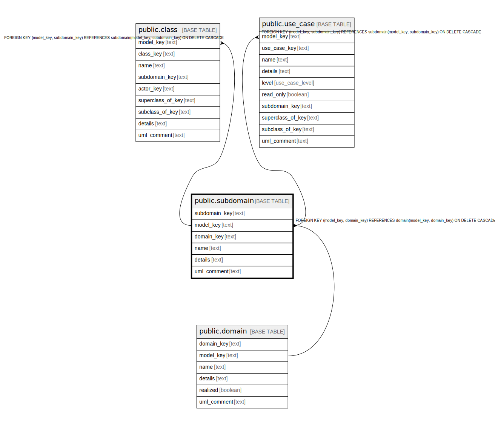

# public.subdomain

## Description

A bucket for parts of a model.

## Columns

| Name | Type | Default | Nullable | Children | Parents | Comment |
| ---- | ---- | ------- | -------- | -------- | ------- | ------- |
| subdomain_key | text |  | false | [public.use_case](public.use_case.md) [public.class](public.class.md) |  | The internal ID. |
| model_key | text |  | false | [public.use_case](public.use_case.md) [public.class](public.class.md) | [public.domain](public.domain.md) | The model this subdomain is part of. |
| domain_key | text |  | false |  | [public.domain](public.domain.md) |  |
| name | text |  | false |  |  | The unique name of the subdomain. |
| details | text |  | true |  |  | A summary description. |
| uml_comment | text |  | true |  |  | A comment that appears in the diagrams. |

## Constraints

| Name | Type | Definition |
| ---- | ---- | ---------- |
| subdomain_domain_key_not_null | n | NOT NULL domain_key |
| subdomain_model_key_not_null | n | NOT NULL model_key |
| subdomain_name_not_null | n | NOT NULL name |
| subdomain_subdomain_key_not_null | n | NOT NULL subdomain_key |
| fk_subdomain_domain | FOREIGN KEY | FOREIGN KEY (model_key, domain_key) REFERENCES domain(model_key, domain_key) ON DELETE CASCADE |
| subdomain_pkey | PRIMARY KEY | PRIMARY KEY (model_key, subdomain_key) |

## Indexes

| Name | Definition |
| ---- | ---------- |
| subdomain_pkey | CREATE UNIQUE INDEX subdomain_pkey ON public.subdomain USING btree (model_key, subdomain_key) |

## Relations

---

> Generated by [tbls](https://github.com/k1LoW/tbls)
