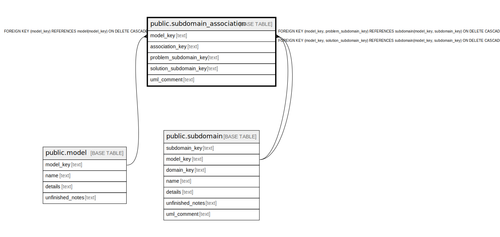

# public.subdomain_association

## Description

A semantic relationship between two subdomains in the same domain.

## Columns

| Name | Type | Default | Nullable | Children | Parents | Comment |
| ---- | ---- | ------- | -------- | -------- | ------- | ------- |
| model_key | text |  | false |  | [public.model](public.model.md) [public.subdomain](public.subdomain.md) | The model this association is part of. |
| association_key | text |  | false |  |  | The internal ID. |
| problem_subdomain_key | text |  | false |  | [public.subdomain](public.subdomain.md) | The subdomain that defines requirements for the other. |
| solution_subdomain_key | text |  | false |  | [public.subdomain](public.subdomain.md) | The subdomain that is constrained by the others requirements. |
| uml_comment | text |  | true |  |  | A comment that appears in the diagrams. |

## Constraints

| Name | Type | Definition |
| ---- | ---- | ---------- |
| subdomain_association_association_key_not_null | n | NOT NULL association_key |
| subdomain_association_model_key_not_null | n | NOT NULL model_key |
| subdomain_association_problem_subdomain_key_not_null | n | NOT NULL problem_subdomain_key |
| subdomain_association_solution_subdomain_key_not_null | n | NOT NULL solution_subdomain_key |
| fk_subdomain_association_model | FOREIGN KEY | FOREIGN KEY (model_key) REFERENCES model(model_key) ON DELETE CASCADE |
| fk_subdomain_association_problem | FOREIGN KEY | FOREIGN KEY (model_key, problem_subdomain_key) REFERENCES subdomain(model_key, subdomain_key) ON DELETE CASCADE |
| fk_subdomain_association_solution | FOREIGN KEY | FOREIGN KEY (model_key, solution_subdomain_key) REFERENCES subdomain(model_key, subdomain_key) ON DELETE CASCADE |
| subdomain_association_pkey | PRIMARY KEY | PRIMARY KEY (model_key, association_key) |

## Indexes

| Name | Definition |
| ---- | ---------- |
| subdomain_association_pkey | CREATE UNIQUE INDEX subdomain_association_pkey ON public.subdomain_association USING btree (model_key, association_key) |

## Relations

---

> Generated by [tbls](https://github.com/k1LoW/tbls)
