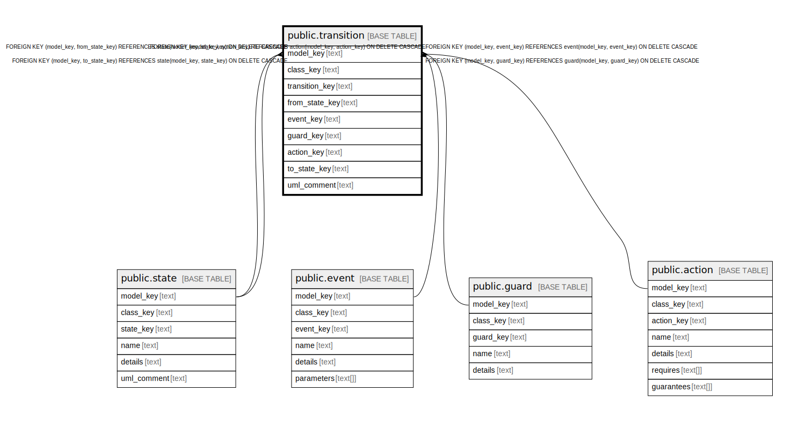

# public.transition

## Description

The movement between states.

## Columns

| Name | Type | Default | Nullable | Children | Parents | Comment |
| ---- | ---- | ------- | -------- | -------- | ------- | ------- |
| model_key | text |  | false |  | [public.state](public.state.md) [public.event](public.event.md) [public.guard](public.guard.md) [public.action](public.action.md) | The model this state machine is part of. |
| class_key | text |  | false |  |  |  |
| transition_key | text |  | false |  |  | The internal ID. |
| from_state_key | text |  | true |  | [public.state](public.state.md) | The state this transition is leaving. If nothing then this is a starting state. |
| event_key | text |  | false |  | [public.event](public.event.md) | The event triggering the transition. |
| guard_key | text |  | true |  | [public.guard](public.guard.md) | If this event has a condition, then what is it. |
| action_key | text |  | true |  | [public.action](public.action.md) | If this event has an action, then what is it. |
| to_state_key | text |  | true |  | [public.state](public.state.md) | The state this transition is entering. If nothing then this is a ending state. |
| uml_comment | text |  | true |  |  | A comment that appears in the diagrams. |

## Constraints

| Name | Type | Definition |
| ---- | ---- | ---------- |
| fk_transition_from | FOREIGN KEY | FOREIGN KEY (model_key, from_state_key) REFERENCES state(model_key, state_key) ON DELETE CASCADE |
| fk_transition_to | FOREIGN KEY | FOREIGN KEY (model_key, to_state_key) REFERENCES state(model_key, state_key) ON DELETE CASCADE |
| fk_transition_event | FOREIGN KEY | FOREIGN KEY (model_key, event_key) REFERENCES event(model_key, event_key) ON DELETE CASCADE |
| fk_transition_guard | FOREIGN KEY | FOREIGN KEY (model_key, guard_key) REFERENCES guard(model_key, guard_key) ON DELETE CASCADE |
| fk_transition_action | FOREIGN KEY | FOREIGN KEY (model_key, action_key) REFERENCES action(model_key, action_key) ON DELETE CASCADE |
| transition_pkey | PRIMARY KEY | PRIMARY KEY (model_key, transition_key) |

## Indexes

| Name | Definition |
| ---- | ---------- |
| transition_pkey | CREATE UNIQUE INDEX transition_pkey ON public.transition USING btree (model_key, transition_key) |

## Relations

---

> Generated by [tbls](https://github.com/k1LoW/tbls)
