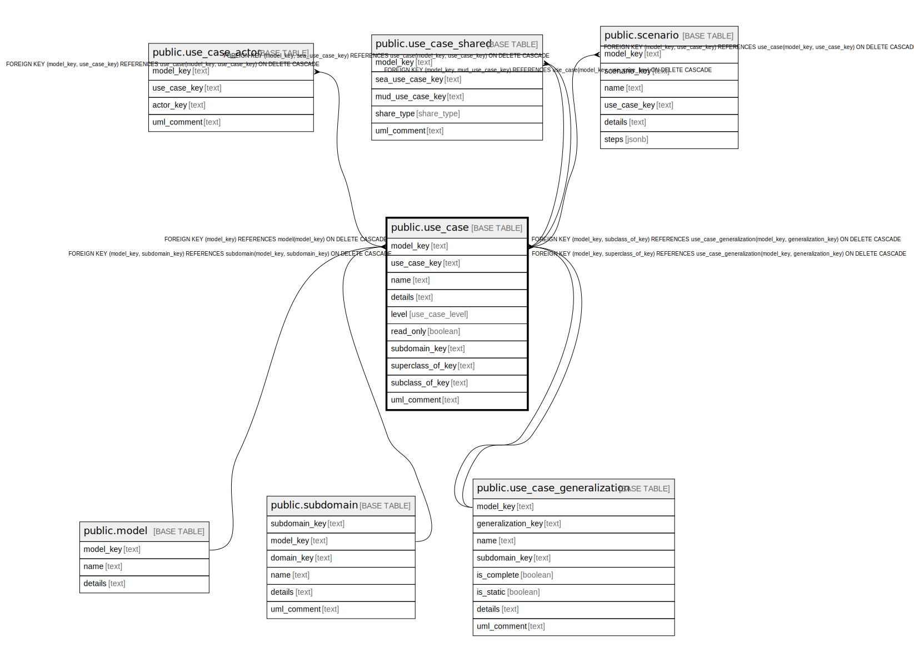

# public.use_case

## Description

A sequence of steps in the business rules.

## Columns

| Name | Type | Default | Nullable | Children | Parents | Comment |
| ---- | ---- | ------- | -------- | -------- | ------- | ------- |
| model_key | text |  | false | [public.use_case_actor](public.use_case_actor.md) [public.use_case_shared](public.use_case_shared.md) [public.scenario](public.scenario.md) | [public.model](public.model.md) [public.subdomain](public.subdomain.md) [public.use_case_generalization](public.use_case_generalization.md) | The model this use case is part of. |
| use_case_key | text |  | false | [public.use_case_actor](public.use_case_actor.md) [public.use_case_shared](public.use_case_shared.md) [public.scenario](public.scenario.md) |  | The internal ID. |
| name | text |  | false |  |  | The unique name of the use case. |
| details | text |  | true |  |  | A summary description. |
| level | use_case_level |  | false |  |  | How big is the scope of this use case. |
| read_only | boolean |  | false |  |  | When true, this use case changes no state. |
| subdomain_key | text |  | false |  | [public.subdomain](public.subdomain.md) | The subdomain this use case is part of. |
| superclass_of_key | text |  | true |  | [public.use_case_generalization](public.use_case_generalization.md) | The generalization this use case is a superclass of, if it is one. |
| subclass_of_key | text |  | true |  | [public.use_case_generalization](public.use_case_generalization.md) | The generalization this use case is a subclass of, if it is one. |
| uml_comment | text |  | true |  |  | A comment that appears in the diagrams. |

## Constraints

| Name | Type | Definition |
| ---- | ---- | ---------- |
| use_case_level_not_null | n | NOT NULL level |
| use_case_model_key_not_null | n | NOT NULL model_key |
| use_case_name_not_null | n | NOT NULL name |
| use_case_read_only_not_null | n | NOT NULL read_only |
| use_case_subdomain_key_not_null | n | NOT NULL subdomain_key |
| use_case_use_case_key_not_null | n | NOT NULL use_case_key |
| fk_use_case_model | FOREIGN KEY | FOREIGN KEY (model_key) REFERENCES model(model_key) ON DELETE CASCADE |
| fk_use_case_subdomain | FOREIGN KEY | FOREIGN KEY (model_key, subdomain_key) REFERENCES subdomain(model_key, subdomain_key) ON DELETE CASCADE |
| fk_use_case_subclass | FOREIGN KEY | FOREIGN KEY (model_key, subclass_of_key) REFERENCES use_case_generalization(model_key, generalization_key) ON DELETE CASCADE |
| fk_use_case_superclass | FOREIGN KEY | FOREIGN KEY (model_key, superclass_of_key) REFERENCES use_case_generalization(model_key, generalization_key) ON DELETE CASCADE |
| use_case_pkey | PRIMARY KEY | PRIMARY KEY (model_key, use_case_key) |

## Indexes

| Name | Definition |
| ---- | ---------- |
| use_case_pkey | CREATE UNIQUE INDEX use_case_pkey ON public.use_case USING btree (model_key, use_case_key) |

## Relations

---

> Generated by [tbls](https://github.com/k1LoW/tbls)
