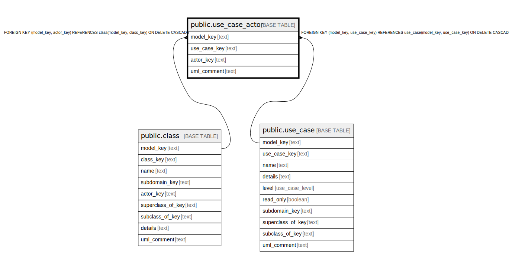

# public.use_case_actor

## Description

Which actors participate in which use cases.

## Columns

| Name | Type | Default | Nullable | Children | Parents | Comment |
| ---- | ---- | ------- | -------- | -------- | ------- | ------- |
| model_key | text |  | false |  | [public.actor](public.actor.md) [public.use_case](public.use_case.md) | The model this use case actor is part of. |
| use_case_key | text |  | false |  | [public.use_case](public.use_case.md) | The use case. |
| actor_key | text |  | false |  | [public.actor](public.actor.md) | The actor. |
| uml_comment | text |  | true |  |  | A comment that appears in the diagrams. |

## Constraints

| Name | Type | Definition |
| ---- | ---- | ---------- |
| fk_uca_actor | FOREIGN KEY | FOREIGN KEY (model_key, actor_key) REFERENCES actor(model_key, actor_key) ON DELETE CASCADE |
| fk_uca_use_case | FOREIGN KEY | FOREIGN KEY (model_key, use_case_key) REFERENCES use_case(model_key, use_case_key) ON DELETE CASCADE |
| use_case_actor_pkey | PRIMARY KEY | PRIMARY KEY (model_key, use_case_key, actor_key) |

## Indexes

| Name | Definition |
| ---- | ---------- |
| use_case_actor_pkey | CREATE UNIQUE INDEX use_case_actor_pkey ON public.use_case_actor USING btree (model_key, use_case_key, actor_key) |

## Relations

---

> Generated by [tbls](https://github.com/k1LoW/tbls)
