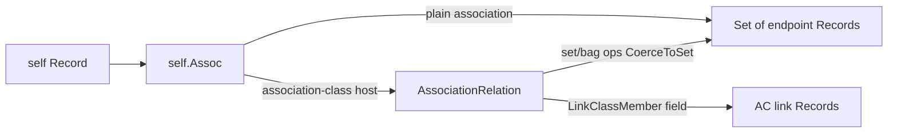

# Association navigations in the requirements model and simulator

A short guide for developers writing class invariants, actions, and globals that talk about **associations**. It describes how the system thinks about associations today, how to write expressions that match that model, and how the exercise simulator evaluates them.

Related: [Attribute `type_spec`](attribute-type-spec.md) for TLA+ type strings; simulator overview in `internal/simulator/README.md`.

---

## The mental model

### Representation vs access (keep these distinct)

**How the simulator stores things** is not the same as inventing TLA+ map types.

| Concept | Internal representation | How TLA+ usually sees it |
| --- | --- | --- |
| Class extent (e.g. `Account`) | Map-like: engine **id → attribute data** | A **set of records** `[id |-> N, data |-> attrs]` — standard TLA record shape, not a special Map type |
| Instance under evaluation (`self`) | Attribute record on that id | **Data only** — `self.amount`, `self.timestamp` (flat attribute SubKeys) |
| Association | Links **id → id** (host rows / endpoints) | Navigation `self.Assoc` as related **endpoints** (see below) |

Class-extent elements are ordinary records with two fields:

```tla
\* One live account in the class extent Account:
[id |-> 3, data |-> [_state |-> "Exists", …]]
```

- **`id`** — engine instance identity (a number). Used so two instances with the same attribute values stay distinct in the set, and so associations can connect ids.
- **`data`** — what used to be thought of as “the object as a set element”: the attribute record (SubKeys).

Authors rarely invent new TLA types for this. Patterns:

```tla
Account /= {}                                    \* extent nonempty
_FiniteSets!Cardinality(Account) >= 3            \* number of instances (by id)
CHOOSE a \in Account : TRUE                      \* a is [id, data]
a.id                                             \* identity
a.data                                           \* attribute record
\* When quantifying the extent and reading attributes:
\E a \in Account : a.data._state = "Exists"
```

**`self` is not the extent element.** In a class invariant or action on a live instance, `self` is the **data** record (attributes), so existing specs keep writing `self.amount` rather than `self.data.amount`.

Association navigations (`self.Adjusts`) still expose related **endpoint data** (or association-class structure) for Approach A quantifiers over peers; the underlying links are id-to-id.

### Instances are id + data

A class instance is not a bare identifier and not “just” an attribute bag. Identity and data are separate; the extent package above makes that visible in TLA without a map type.

### Associations are relations

An association between two classes is a **relation**: pairs of instances (from-side to to-side).

Navigation from one instance:

```text
self.AssocName     →  the set of related instances on the far side (the relation image)
self._AssocName    →  reverse direction (when the model exposes reverse navigation)
```

So `self.ShipsTo` means “every Address related to this Order via ShipsTo,” as a **set of Address records**.

Formally you can think of:

\[
\mathrm{Assoc} \subseteq \mathit{From} \times \mathit{To}
\quad\text{or}\quad
\mathrm{Assoc} \in [\mathit{From} \to \mathrm{SUBSET}\ \mathit{To}]
\]

Authors almost always write the **navigable image** form (`self.Assoc`), not explicit pairs.

### Association classes reify each pair

When an association has an **association class**, each linked pair is reified by **exactly one** association-class instance (one link row per pair). That row holds attributes that belong to the *relationship*, not only to either endpoint.

**Action guarantees (authoring).** Creating association-class rows uses two related state_change items:

1. **Relation image** (optional) — target is the association TLA field; RHS is the opposite-side set only.
2. **Association-class reify** — target is the association-class TLA name; `endpoint_selector` is LET-like (often a set-map over a parameter domain); `specification` is only the AC creation call.

Rendered in class markdown (selector bullet **before** the AC assignment):

```text
- **Adjusts selector: { r.account : r ∈ Amounts }**
- **AccountBalanceChange' = «new»(r.amount)**
```

YAML:

```yaml
- target: AccountBalanceChange
  endpoint_selector: '{ r.account : r \in Amounts }'
  specification: '_new(r.amount)'
```

The selector supplies the domain binder (`r`) and far-side endpoint expression; the AC guarantee body does not restate the domain.

```text
Order ──ShipsTo──► Address
           │
        Shipment   (association class: status, fee, …)
```

- Endpoint attributes live on `Address` (e.g. `region`).
- Link attributes live on `Shipment` (e.g. `status`).
- There is at most one `Shipment` for a given `(Order, Address)` pair.

---

## Writing expressions (preferred style)

Prefer **class-local navigation**: start from `self`, walk the association image, and use quantifiers. That is the style almost all invariants should use.

### Existence: related object has an attribute in a known set

**Scenario:** Class `Order` has association `ShipsTo` → `Address`.  
**Intent:** There exists a related address whose `region` is allowed.

```tla
AllowedRegions == {"US", "CA", "GB"}

\* On class Order:
\E a \in self.ShipsTo : a.region \in AllowedRegions
```

| Piece | Meaning |
| --- | --- |
| `self.ShipsTo` | Relation image: set of related Address records |
| `a \in self.ShipsTo` | One related address |
| `a.region` | Attribute **SubKey** on that endpoint |
| `AllowedRegions` | Named set / constant / global |

### Combined: endpoint attribute and association-class attribute

**Scenario:** Same association, association class `Shipment` (one row per pair).  
**Intent:** There exists a related **Address** with `region` allowed, **and** the **Shipment** for that same pair has `status` in a different allowed set.

```tla
AllowedRegions  == {"US", "CA", "GB"}
AllowedStatuses == {"pending", "shipped"}

\* On class Order:
\E a \in self.ShipsTo :
  /\ a.region \in AllowedRegions
  /\ self.ShipsTo.Shipment.status \in AllowedStatuses
```

| Piece | Meaning |
| --- | --- |
| `a \in self.ShipsTo` | Related **Address** (endpoint) |
| `a.region \in AllowedRegions` | Endpoint attribute in one allowed set |
| `self.ShipsTo.Shipment` with binder `a` | The **unique** Shipment for pair `(self, a)` |
| `.status \in AllowedStatuses` | AC attribute in a **different** allowed set |

Because there is only one association-class instance per pair, under binder `a` the shipment is a **scalar** link row—not a set. You do not need a second `\E s \in …` for the per-pair case.

**Every** related address and its shipment:

```tla
\A a \in self.ShipsTo :
  /\ a.region \in AllowedRegions
  /\ self.ShipsTo.Shipment.status \in AllowedStatuses
```

### Universal and emptiness checks

```tla
\A a \in self.ShipsTo : a.region \in AllowedRegions

self.ShipsTo = {}

_FiniteSets!Cardinality(self.ShipsTo) = 1
```

Use **`_FiniteSets!Cardinality`** for the size of a set (including association images). That matches conventional TLA+ FiniteSets. Do **not** pass a set to `_Bags!BagCardinality`—bags are a different type; convert only when you need bag ops:

```tla
_Bags!BagCardinality(_Bags!SetToBag(self.ShipsTo)) = 1   \* set → bag → bag size (same number when multiplicities are 1)
```

### Field names: SubKeys and association-class member names

| Kind | What to write | Source |
| --- | --- | --- |
| Attribute on a record | Attribute **SubKey** (e.g. `amount`, `region`) | Class attribute key — not the human display `name` (`Amount`) |
| Association-class member on a navigation | Normalized association-class **display name** (spaces removed, e.g. `AccountBalanceChange`, `Shipment`) | AC class name after normalize |
| Association itself | Association **name** as declared (`ShipsTo`, `Adjusts`) | Association metadata |

```tla
\* Correct if SubKey is amount:
self.Adjusts.AccountBalanceChange.amount

\* Wrong if you use the display label:
self.Adjusts.AccountBalanceChange.Amount
```

### What not to do

```tla
\* Wrong — treats AC fields as if they lived on the endpoint:
\E a \in self.ShipsTo :
  a.region \in AllowedRegions /\ a.status \in AllowedStatuses

\* Wrong — invents helpers that are not real Bags operators:
_FiniteSets!Cardinality(self.ShipsTo)
```

Keep `_Bags!` limited to real bag operators (`SetToBag`, `BagToSet`, `CopiesIn`, `BagIn`, `BagCardinality`) per the attribute-type / stdlib discipline in this package.

---

## Global functions over associations

Globals should take **sets of records of a known shape** (endpoint records **or** association-class rows). The call site should make the view obvious.

```tla
\* Operates on Address records:
HasAllowedRegion(addresses) ==
  \E a \in addresses : a.region \in AllowedRegions

\* Call from Order:
HasAllowedRegion(self.ShipsTo)
```

```tla
\* Operates on association-class rows that carry amount:
_AmountsBag(rows) ==
  \* recursive bag of row.amount over the set rows …
_SumAmounts(amounts) ==
  \* sum over a bag of amounts …

\* Call with AC rows, not naked endpoints and not already-projected numbers:
_SumAmounts(_AmountsBag(self.Adjusts.AccountBalanceChange))
```

Avoid globals that secretly reinterpret “whatever `self.Assoc` is” as endpoints *or* link rows without the call site showing which.

---

## How the simulator evaluates this

You do not need this section to write good model expressions. It helps if you debug evaluations or read simulator code.

### Runtime values



| Navigation kind | Runtime value | Set/bag view |
| --- | --- | --- |
| Plain association (no AC) | `*object.Set` of endpoint records | Itself |
| Host association with association class | `*object.AssociationRelation` | Endpoints via `CoerceToSet` / `Endpoints()` |

`AssociationRelation` also holds:

- `LinkClassMember` — TLA name for the AC (normalized class display name)
- `linkByEndpoint` — map from far endpoint record → unique AC row for that pair

### Set and bag operators

Membership, quantifiers (`\E`, `\A`), `CHOOSE`, set algebra, and bag conversion treat the association as its **endpoint image**:

- `_FiniteSets!Cardinality(self.Assoc)` — size of the endpoint image (set cardinality)  
- `_Bags!SetToBag(self.Assoc)` — convert image to a bag (one copy per distinct endpoint) for bag operators  
- `_Bags!BagCardinality(B)` — size of a **bag** only (not a set)  
- `self.Assoc = {}` — empty image (works for both Set and AssociationRelation)

### Field access on association navigations

For an association-class host navigation `rel = self.Assoc`:

1. **`rel.LinkClassMember`** (e.g. `self.ShipsTo.Shipment`)  
   - One endpoint or a unique **bound** endpoint in scope → **scalar** AC row  
   - Several endpoints, no unique binder → **set** of all AC rows for those pairs  
   - No endpoints → empty set  

2. **Field present on every endpoint** (e.g. `self.ShipsTo.region` or `Code`)  
   - Sole or unique binder → **scalar**  
   - Else → **set** of projected values  

3. **Field present on every AC row** (e.g. `self.ShipsTo.Fee` when Fee is only on the link)  
   - Same sole/binder rule → scalar or set of link-field values  

4. Otherwise → evaluation error describing what was tried  

**Binder rule:** If you bind `a \in self.ShipsTo` in a quantifier, then `self.ShipsTo.Shipment` and endpoint-only fields on that navigation resolve to the **pair involving `a`**, not the whole multi set. That is what makes the combined existence invariant work.

### Field access on a set of records

When a step yields a set of records (for example multi-endpoint `self.Assoc.Shipment`), a further field access maps over the set:

```text
{ r1, r2 }.amount  →  { r1.amount, r2.amount }
```

Empty set → empty set. Missing field on any element → error. Nested non-record elements are not allowed.

### Bags vs sets (endpoints vs values)

| Concept | Multiplicity story |
| --- | --- |
| Host association pairs | At most **one** AC row per `(from, to)` pair |
| Endpoint **set** | Unique by structural content of the endpoint record |
| **Bags of values** (e.g. amounts) | Several link rows may share the same amount; use `_Bags!` and projections over **link rows** |

“Bag-like id+data” means class extents and **value** multisets. It does not mean multi-edges between the same two instances.

### Equality

| Comparison | Rule |
| --- | --- |
| AssociationRelation ↔ Set | Equal if **endpoint sets** are equal (link rows ignored) |
| AssociationRelation ↔ AssociationRelation | Full equality: same endpoints **and** same link rows |
| Association ↔ `{}` | True when the endpoint image is empty |

---

## Declaring associations in the model

In human-facing class / association metadata:

1. Declare the association with `name`, multiplicities, and endpoint class keys.  
2. Optionally set `association_class_key` when the link carries its own attributes.  
3. Write invariants and action logic with **navigation + quantifiers** as above.  
4. Use attribute **SubKeys** and the normalized AC **class name** in expressions.

The model language is the source of truth. The simulator evaluates that surface; it does not require TLC-style total functions on `Id` in author-facing specs.

---

## Quick reference

```tla
\* Existence on endpoint
\E a \in self.Assoc : a.attr \in AllowedSet

\* Existence on endpoint + AC row for the same pair
\E a \in self.Assoc :
  /\ a.endpointAttr \in EndpointAllowed
  /\ self.Assoc.LinkClassMember.linkAttr \in LinkAllowed

\* Universal
\A a \in self.Assoc : P(a)

\* Empty / count
self.Assoc = {}
_FiniteSets!Cardinality(self.Assoc) = n

\* Globals: pass the right set of records
MyGlobal(self.Assoc)                          \* endpoints
MyGlobal(self.Assoc.LinkClassMember)          \* AC rows (multi → set; sole → use carefully)
```

### Code map (for implementers)

| Concern | Location under `internal/simulator/` |
| --- | --- |
| Relation traversal | `evaluator/eval_relation.go` |
| Coerce AR → endpoint set | `evaluator/set_coerce.go` |
| Bag builtins | `evaluator/builtins.go` |
| AC / association field projection | `evaluator/association_class_link.go` |
| Field access (incl. set of records) | `evaluator/eval_me.go` |
| AssociationRelation type | `object/association_relation.go` |
| Host link table | `state/association_link_table.go` |
| Relation metadata | `evaluator/relation_context.go` |

---

## Summary

1. **Instances** = id + data records.  
2. **Associations** = relations; **`self.Assoc`** = set (image) of related records.  
3. **Association classes** = one link row per pair; navigate with `self.Assoc.LinkClassMember` under an endpoint binder when both sides matter.  
4. Write invariants with **quantifiers over the image**, attribute **SubKeys**, `_FiniteSets!Cardinality` for set size, and `_Bags!` only on bags (use `SetToBag` to convert).  
5. Class extents are sets of `[id, data]` records; `self` stays flat **data**. Associations link **ids**.  
6. The simulator coerces association navigations to endpoint sets for set ops and `SetToBag` / `Cardinality`, and projects AC fields with sole/binder awareness.
