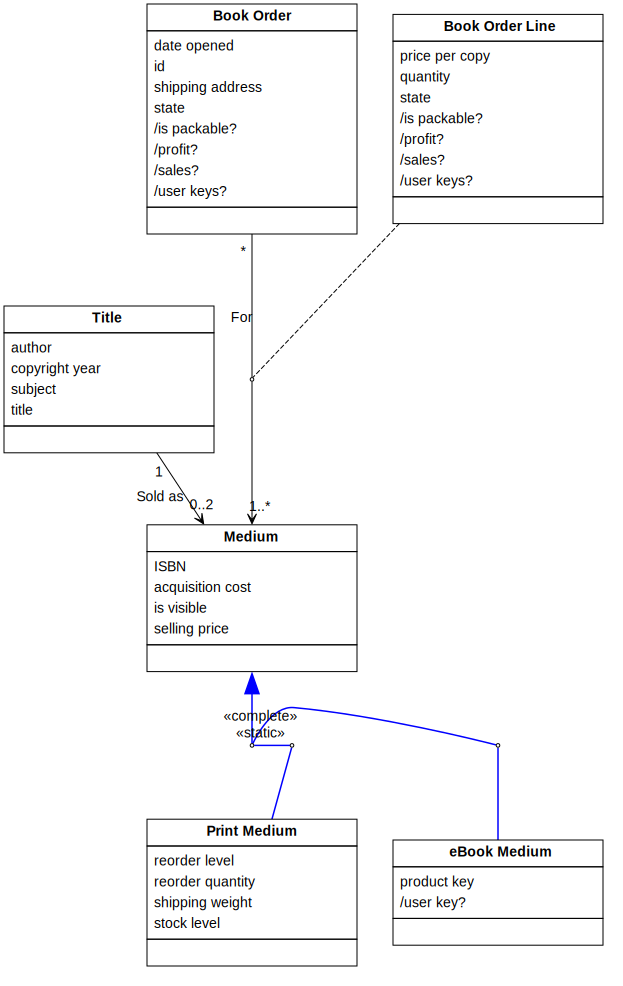

[⇦ Order Fulfillment](domain-01_order_fulfillment.md)

# Medium

This class repressents the different forms in which Titles are available for sale.
There are curently two kinds of Meidum: Print medium and eBook medium, which are detailed
in their own classes. Audio books may be added at a later date. This class has no
state diagram because it is a superclass and the state models are unique to the 
subclasses.

## Attributes

| Name | Rules | Nullable | Comment |
| ---- | ----- | -------- | ------- |
| ISBN | either ISBN-10 or ISBN-13 format as dfined by www.isbn-international.org   | false | The Internaltional Standard Book Nummber assigned by the Publisher to this Medium. ISBNs are unique by Medium; the eBook and Print medium versions of the same Title will have different ISBNs. More information on ISBNs can be found online. |
| acquisition cost | $0.00 .. unconstrained in US Dollars, to the nearest whole cent   | false | The price that WebBooks pays the Publisher for each copy of this Medium so that profit can be calculated. In some cases, publishers may give copies to WebBooks at no cost. |
| is visible | true or false   | false | Media may be visible or invisible. When visible, this Medium will appear to Customers in the catalog (e.g., when they do searches). When not visible, this Medium won't appear to Customers although it is still know to the business (Managers can still see it). This allows WebBooks to pre-stage Media before going live as well as take them down when necessary (without deleting them). |
| selling price | $0.00 .. unconstrained in US Dollars, to the nearest whole cent   | false | The current per-copy price that WebBooks is offering this Medium to customers. In some cases, WebBooks may offer certain Media for free. |

## Relations

# State Machine

## State and Event Descriptions

The states for this class.

*None*

The events for this class.

*None*

## Action Specifications

The actions for this class.

*None*

