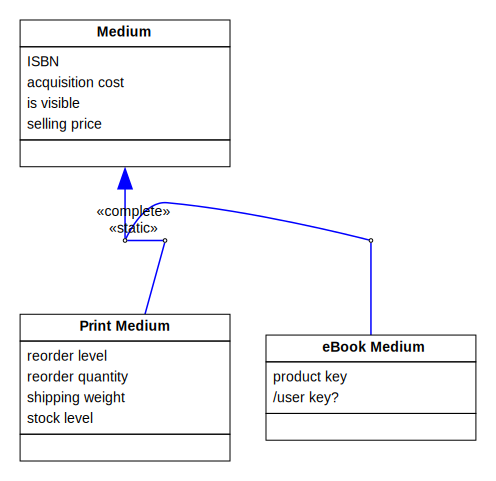
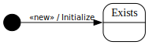

[⇦ Order Fulfillment](domain-01_order_fulfillment.md)

# eBook Medium

This class represents a specific Title being offered for sale to Customers in eBook (i.e. "e-reader") format.

## Attributes

| Name | Rules | Nullable | Comment |
| ---- | ----- | -------- | ------- |
| product key | see Engineering Memo PQR789   | false | Part of Digital Rights Managerment (DRM), which represents the eBook medium-spreicfic encryption key for this Title. This is mashed together with a publisher key and given to the Customer so they can unlock and access each legal copy of the Title on the device they bought it for. |
| /user key? |   see Engineering Memo PQR789, uses .product key and Title.publisher key via Sold as. | false | Shows the user key a Custoemr needs to unlock an eBook on their reader. |

## Relations

# State Machine

## State and Event Descriptions

The states for this class.

- **Exists.** The medium is in the system.

The events for this class.

- **«new».** Create this medium. Parameters:
   - *title.* somewhere
   - *isbn.* somewhere
   - *price.* somewhere
   - *cost.* somewhere
   - *media key.* somewhere

## Action Specifications

The actions for this class.

### Initialize(title, isbn, price, cost, media key)

Add a new medium to the system.

Requires:

- ISBN is consistent with the range of Medium.ISBN,
price is consistent with the range of Medium.selling price,
cost is consistent with the range of Medium.acquisition cost,
media key is consistent with the range of .product key

Guarantees:

- one new eBook Medium exists with:
    - .isbn == isbn,
    - .selling price == price,
    - .acquistion cost == cost,
    - .is visible == false,
    - .product key == media key,
    - this Medium linked to its Title via Sold As

Triggered from:

- «new»(title, isbn, price, cost, media key)

