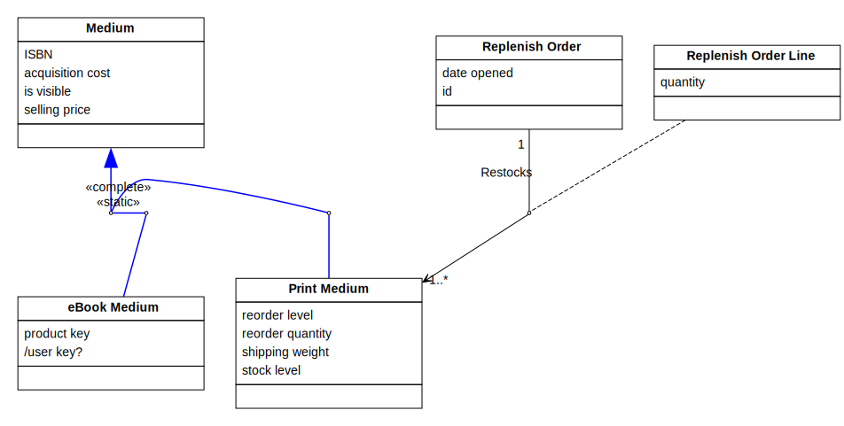
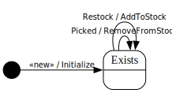

[⇦ Order Fulfillment](domain-01_order_fulfillment.md)

# Print Medium

This class represents as specific Title being offered for sale to Customers in print (aka "physical book," or paper) format.

## Attributes

| Name | Rules | Nullable | Comment |
| ---- | ----- | -------- | ------- |
| reorder level | 1 .. unconstrained, to the nearest whole number   | false | The inventory level below which more copies need to be ordered from the Publisher. |
| reorder quantity | 1 .. unconstrained, to the nearest whole number   | false | When more inventory is needed from the Publisher, this is the number of copies to request. |
| shipping weight | 1 .. unconstrained grams, to the nearest whole gram   | false | The shipping weight of one copy of this Print medium for calculating shipping costs. |
| stock level | 0 .. unconstrained, to the nearest whole number   | false | The number of physical copies of the book in WebBooks inventory, available to be packed and shipped to Customers. |

## Relations

# State Machine

## State and Event Descriptions

The states for this class.

- **Exists.** The medium is in the system.

The events for this class.

- **Picked.** Items of the medium have been picked for an order to ship. Parameters:
   - *qty.* somewhere

- **Restock.** Items have been added to the inventory from a shipment received. Parameters:
   - *qty.* somewhere

- **«new».** Create this medium. Parameters:
   - *title.* somewhere
   - *isbn.* somewhere
   - *price.* somewhere
   - *cost.* somewhere
   - *stock qty.* somewhere
   - *trigger level.* somewhere
   - *reorder qty.* somewhere
   - *weight.* somewhere

## Action Specifications

The actions for this class.

### AddToStock(qty)

Add more of this medium to the inventory.

Requires:

- qty > 0

Guarantees:

- post( .stock level ) == pre( .stock level ) + qty

Triggered from:

- Restock(qty)

### Initialize(title, isbn, price, cost, stock qty, trigger level, reorder qty, weight)

Add a new medium to the system.

Requires:

- ISBN is consistent with the range of Medium.ISBN
- price is consistent with the range of Medium.selling price
- cost is consistent with the range of Medium.acquisition cost
- stock qty is consistent with the range of stock level
- trigger level is consistent with the range of reorder level
- reorder qty is consistent with the range of .reorder quantity
- weight is consistent with the range of .shipping weight

Guarantees:

- one new Print Medium exists with:
    - .isbn == isbn
    - .selling price == price
    - .acquistion cost == cost
    - .is visible == false
    - .stock level == stock qty
    - .reorder level == trigger level
    - .reorder quantity == reorder qty
    - .shipping weight == weight
    - this Medium linked to its Title via Sold As

Triggered from:

- «new»(title, isbn, price, cost, stock qty, trigger level, reorder qty, weight)

### RemoveFromStock(qty)

Remove some of this medium from the inventory.

Requires:

- qty > 0

Guarantees:

- post( .stock level ) == pre( .stock level ) - qty

- if pre( .stock level ) was already below .reorder level
    - then replenish ( qty ) was has already been signaled to Title via Sold As
    - otherwise if post( .stock level ) went below .reorder level
    - then signal replenish ( .reorder quantity ) for Title via Sold As

Triggered from:

- Picked(qty)

