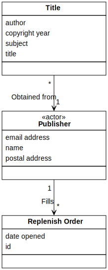
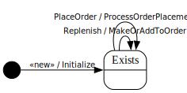

[⇦ Order Fulfillment](domain-01_order_fulfillment.md)

# Publisher

This is an actor that represents external companies who publish and distribute books that WebBooks sells.
WebBooks obtains both physical copies of Print media and publisher keys for eBooks from teh relevant Publisher.
While actor classes generally don't have state models, this is a relatively rare 
exception in that it does have behavior relevant to WebBooks processes. That behavior is shown in the 
state diagram, and the remainder of the behavior is outside the scope of Order Fulfillment.

## Attributes

| Name | Rules | Nullable | Comment |
| ---- | ----- | -------- | ------- |
| email address | any valid email address acoording to relevant IETF specifications   | false | The address that will be used for all (email) communication between this Publisher and WebBooks. Publishers may have more than one email address, but they must select only one of them for primary communication with WebBooks. |
| name | unconstrained   | false | The name of the Publisher--how they would like to be referred to--such as "Permanent Press" or "JKL Publishing House". |
| postal address | any mailing address acceptable to the US Post Office and Canada Post   | false | The primary postal mailing address of the publsiher. A publisher may have more than one valid postal mailing address but must choose only one to be their primary contact mailing address. |

## Relations

# State Machine

## State and Event Descriptions

The states for this class.

- **Exists.** The publisher is in the system.

The events for this class.

- **PlaceOrder.** WebBooks orders new media from Publisher. Parameters:
   - *order id.* somewhere
   - *collection of (isbn, qty).* somewhere

- **Replenish.** Send new media to WebBooks. Parameters:
   - *medium.* somewhere
   - *qty.* somewhere

- **«new».** Create this publisher. Parameters:
   - *name.* somewhere
   - *email.* somewhere
   - *address.* somewhere

## Action Specifications

The actions for this class.

### Initialize(name, email, address)

Add a new medium to the system.

Requires:

- email is consistent with the range of .email address
- address is consistent with the range of .postal address

Guarantees:

- one new Publisher exists with:
    - .name == name
    - .email == email
    - .postal address == address

Triggered from:

- «new»(name, email, address)

### MakeOrAddToOrder(medium, qty)

Remove some of this medium from the inventory.

Requires:

*None*

Guarantees:

- if no open Replenish order already exists for this Publsiher via Fills
    - then new (Print medium, qty) has been signaled
    - otherwise add (Print medium, qty) has been signaled
    - for that open Replenish order via Fills

Triggered from:

- Replenish(medium, qty)

### ProcessOrderPlacement(order id, collection of (isbn, qty))

Add more of this medium to the inventory.

Requires:

*None*

Guarantees:

- Publisher is aware of the contents of the Replenish order via Fills
    - (note: this is really external, it's shown for completeness in this model)

Triggered from:

- PlaceOrder(order id, collection of (isbn, qty))

