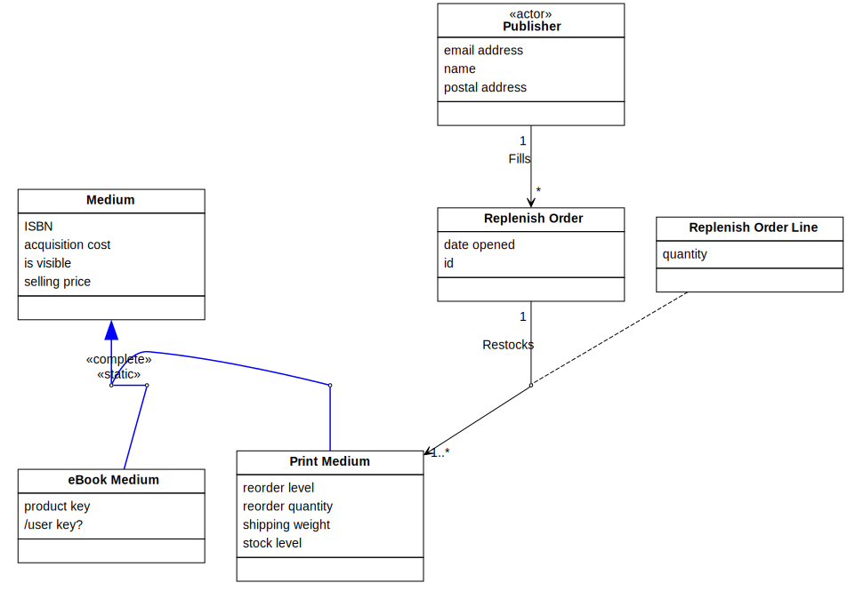
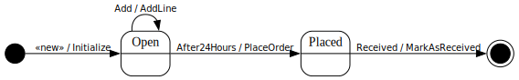

[⇦ Order Fulfillment](domain-01_order_fulfillment.md)

# Replenish Order

This represents a request by WebBooks to a given
Publisher to obtain more physical copies of a specified set of Print Media.

## Attributes

| Name | Rules | Nullable | Comment |
| ---- | ----- | -------- | ------- |
| date opened | calendar date no earlier than January 1, 1998, and no later than today, to the nearest whole day   | false | The date with this Replenish Order was originally created, that is, the first Replenish Order Line was put in. |
| id | refer to corporate policy CP123b   | false | This is used outside the domain to correlate this Replenish Order with other external processes. |

## Relations

# State Machine

## State and Event Descriptions

The states for this class.

- **Open.** The order is created.
- **Placed.** This order is in process.

The events for this class.

- **Add.** Add a line to the Replenish Order. Parameters:
   - *print medium.* somewhere
   - *qty.* somewhere

- **After24Hours.** Trigger after 24 hours to to give time for the order to have more lines added, bundling replenish into fewer but larger orders.
- **Received.** The Publisher has received this order.
- **«new».** Create this Replenish Order.

## Action Specifications

The actions for this class.

### AddLine(print medium, qty)

Add a line to a Replenish Order.

Requires:

*None*

Guarantees:

- if a Replenish Order Line for Print Medium (via Restocks) doesn't already exist:
    - then new (print medium, qty) has been signaled for Replenish Order Line,
    - otherwise add (qty) has been signaled for that existing line

Triggered from:

- Add(print medium, qty)

### Initialize()

Start a new Replenish Order.

Requires:

*None*

Guarantees:

- one new Replenish Order exists with:
    - .id properly assigned,
    - .date opened == today

Triggered from:

- «new»()

### MarkAsReceived()

Each replenish line has been restocked.

Requires:

*None*

Guarantees:

- received has been signaled for each Replenish Order Line via Restocks

Triggered from:

- Received()

### PlaceOrder()

Place the order with a Publisher.

Requires:

*None*

Guarantees:

- Publisher is aware of the contents of this Replenish Order (and lines) via Fills

Triggered from:

- After24Hours()

